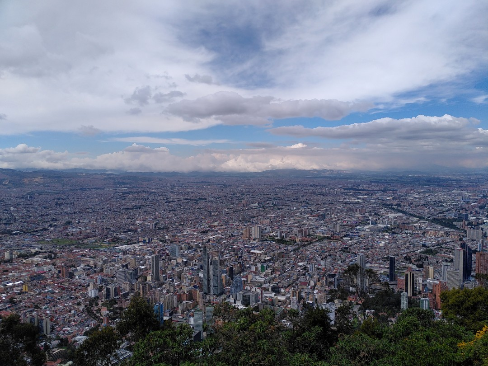

+++
title = "Street Art, Salsa & 10 Million People"
date = 2025-02-15
authors = ["Julian"]

[extra]
location = [4.595768769480833, -74.07156839122118]
+++

I think it's not exaggerated to say Colombia's capital Bogotá is huge - the whole metropolitan area houses about 10 million people and stretches as far as one can see.

The very accessible _Monserrate_ mountain provides a break from the noisy traffic and a great view of the city.
It's also home to a statue titled _Homeless Jesus_, right in front of a church.

The bordering district _La Candelaria_ is known both for its historic buildings and masterful street art, often highlighting the struggle of indigenous tribes with problems like corruption, poverty and general under-representation.
I didn't take a lot of pictures in the streets though since that's a good way to loose one's phone.
Local artist Carlos Trilleras however supports up and coming artists in his gallery.

While the locals don't seem as salsa-crazy as in Cali, we managed to find a nice bar even with live music!
