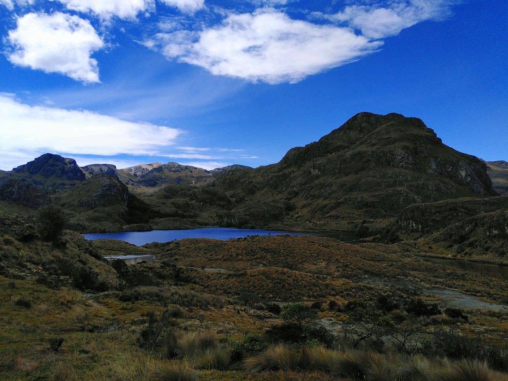
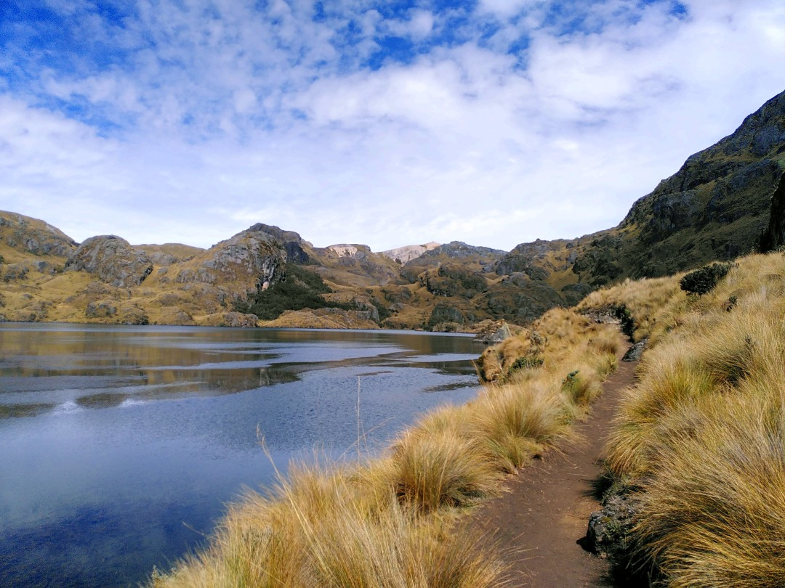
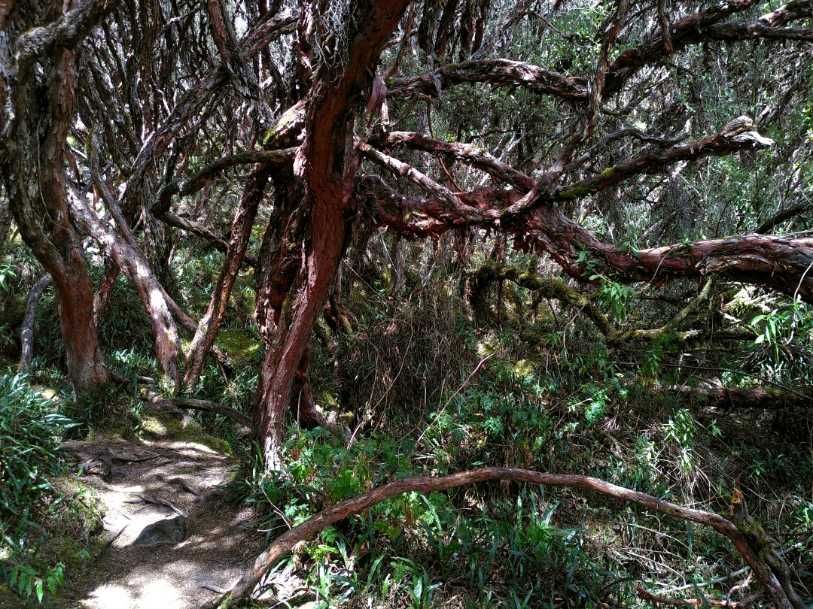
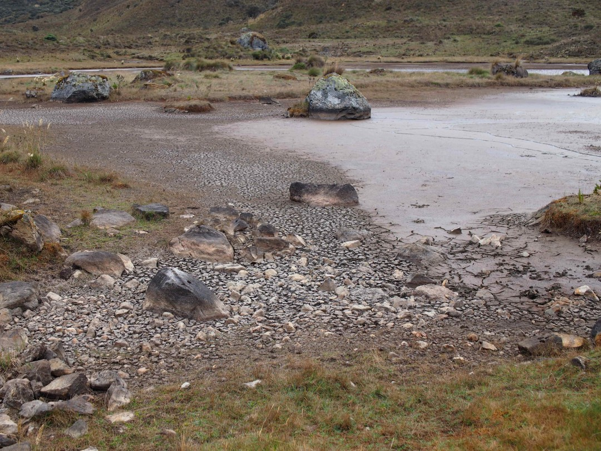

+++
title = "Side Effects of Climate Change"
date = 2024-12-27
author = "Julian"

[extra]
location = [-2.7823987, -79.2236094]
+++

About an hour by bus from Cuenca begins the Cajas National Park with it's many lagoons, mountains and thick bushes of Andean grass.

Despite their accessibility, we had the trails and sights almost for us alone when we visited on a sunny day.

I was especially fascinated by a small, but dense forest of knotty trees, massive boulders and moss covering everything, located on the shady flank of a mountain.

Over our time in Ecuador however, we did not only witness beautiful nature, but also some rather serious side effects of the climate change endangering it:
Since the beginning of 2024, the country had to ration it's power consumption for lack of water to fuel it's hydroelectric power plants.
The measures commonly known as _cortes de la luz_ mean that electricity may be unavailable for 8 to 12 hours a day.
Sadly, lots of businesses in the cities resort to noisy and inefficient generators running on gasoline to bridge the hours without power.

The drought is commonly attributed to more extreme weather due to changing climate and could also be observed in the national park.
While some lakes seemed to carry a good amount of water, many places (like the forest) appeared quite dry on closer inspection and other lagoons were obviously dried out.
