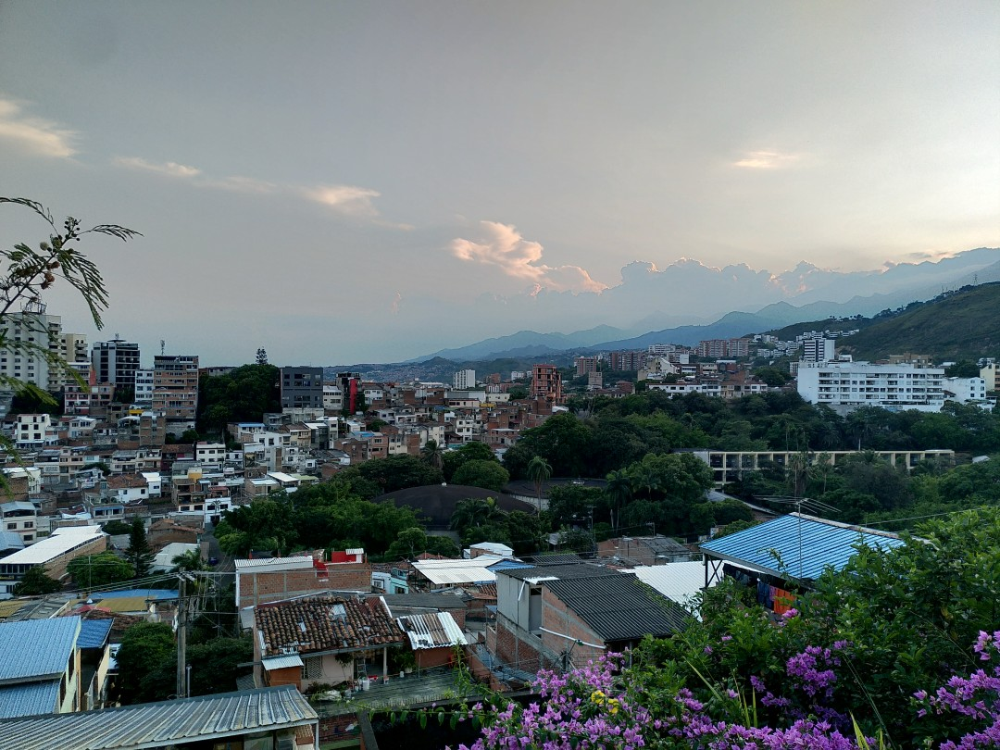
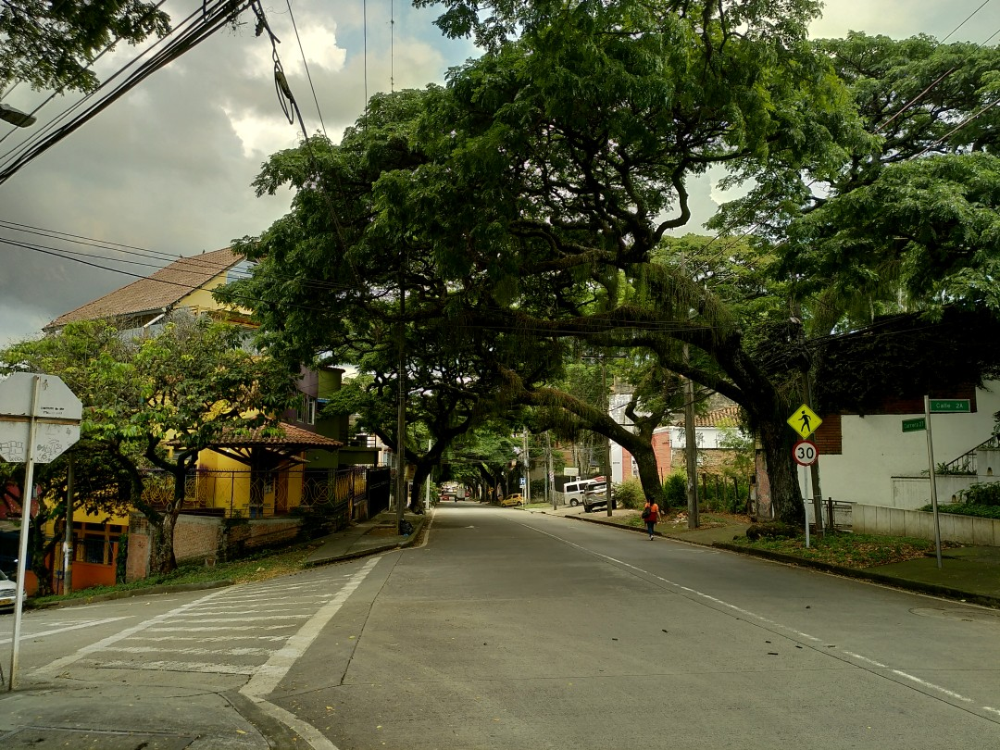
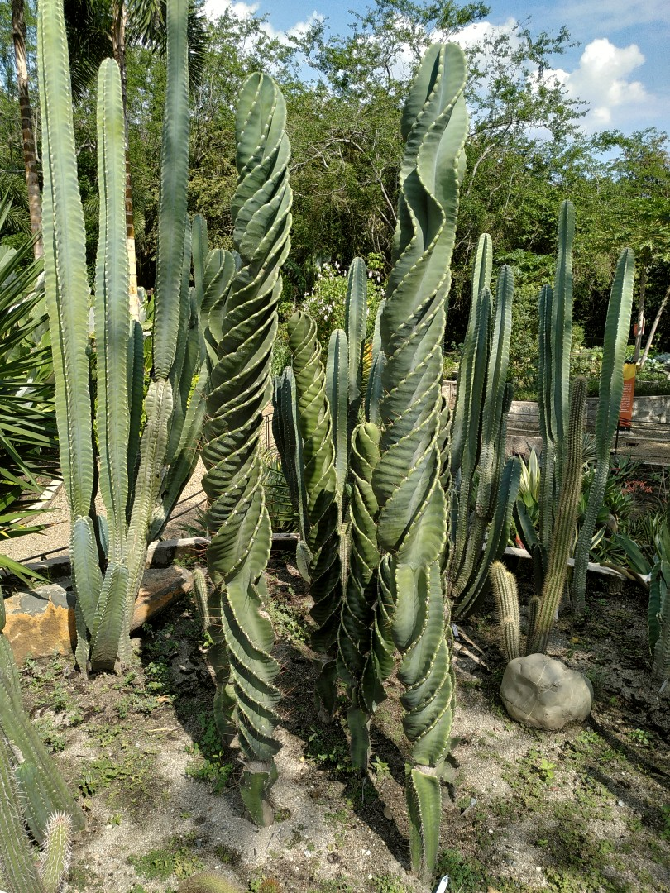
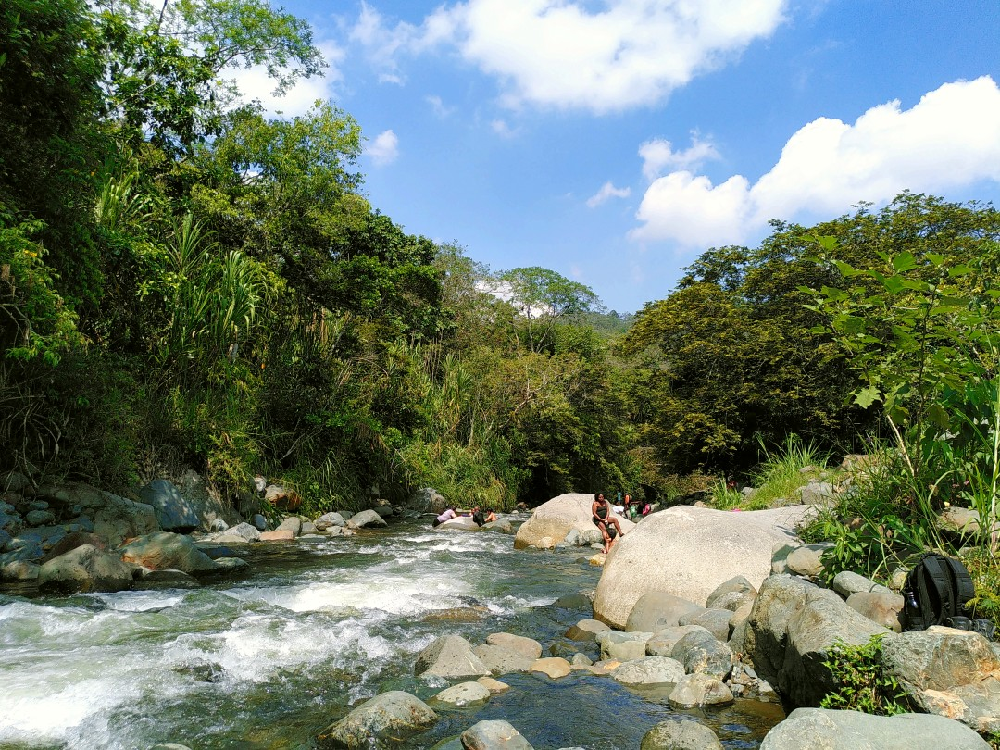
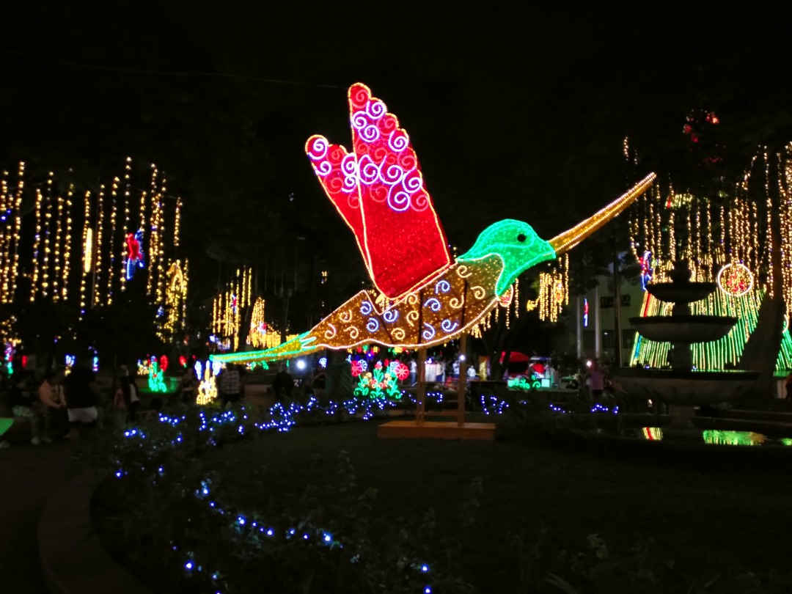

+++
title = "Cali es Cali"
date = 2025-01-15
authors = ["Julian"]

[extra]
location = [3.451504949660507, -76.5340322053426]
+++

One of our first stays in Colombia was in Cali.
While most of the city itself is not classically beautiful, it is always warm and occasionally has some nicely green streets.

It's also home to a botanical garden with funny looking cacti beside other plants in a shady forest.
Just watch out for sizeable iguanas falling from the trees from time to time!

Public transport by buses (partially in a dedicated lane) works quite well and on weekends many locals use it to escape the town and cool down in the nearby _Rio Pance_.

However, the one thing Cali is justifiably known for is its enthusiasm for _salsa_ music.
The music is heard all over the place and you'll find bars full of dancing people on a regular Wednesday evening.
You can also learn about both the music's and the city's history in a dedicated salsa museum featuring photos of artists visiting Cali over more than 40 years.

Each Friday night, everyone gathers around _Boulevard del Rio_ to dance while others bring typical percussion instruments and a DJ plays - you guessed it - salsa.
When we attended in December, the scene was additionally illuminated by colourful Christmas lights.
