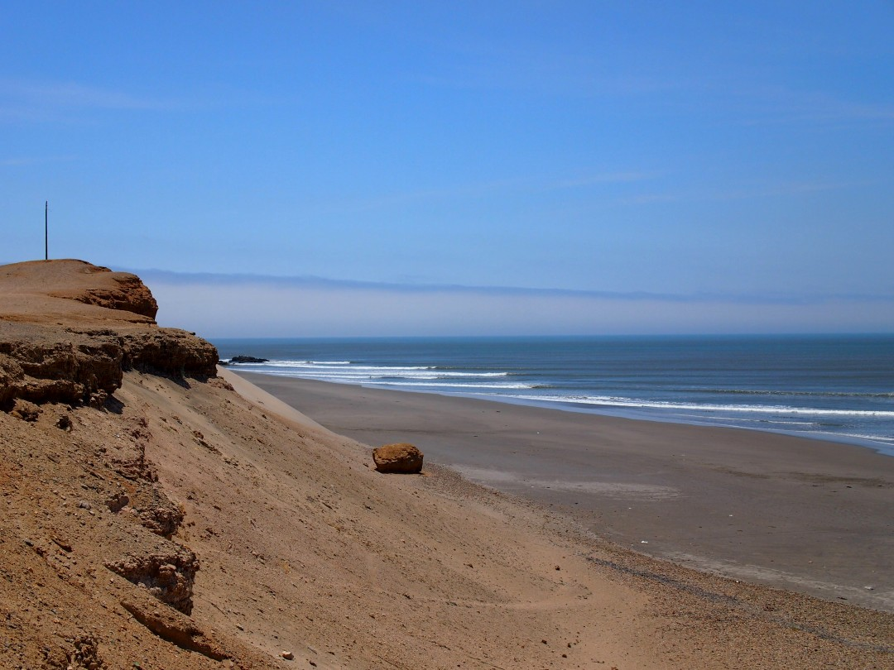
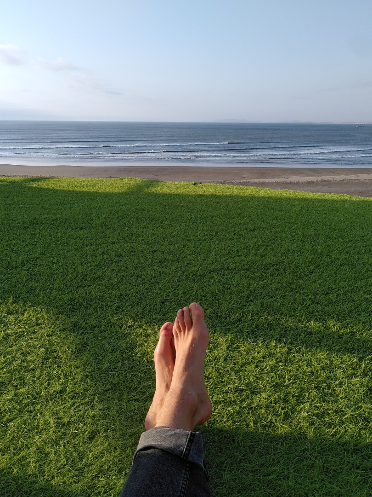
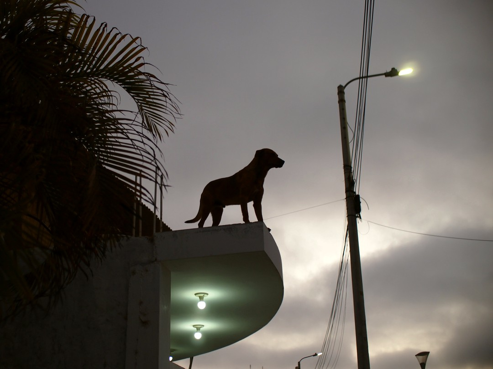

+++
title = "World's Longest Wave"
date = 2024-12-05
authors = ["Julian"]

[extra]
location = [-7.705915662943123, -79.45221778427849]
+++

After spending so much time in the mountains, we finally made it to to the coast at Puerto Malabrigo.
The little town is most famous for its surfing spot _Chicama_, which is considered one of (if not _the_) longest running wave in the world.
On a good day, skilled surfers can ride the wave over several hundred meters all the way along the coast into the bay.

Aside from surfing though, there's not much to do in the former fishing village.
We enjoyed relaxing in the sun and befriending some local dogs as a welcome break from changing location every couple of days.

")
Best time to surf at Puerto Malabrigo is often in the mornings and evenings, when the strong desert winds are not that much of an issue.
Being in the Peruvian desert doesn't necessarily mean it's hot, however -
walking back to the peak of the wave after catching some long ones can get quite chilly.