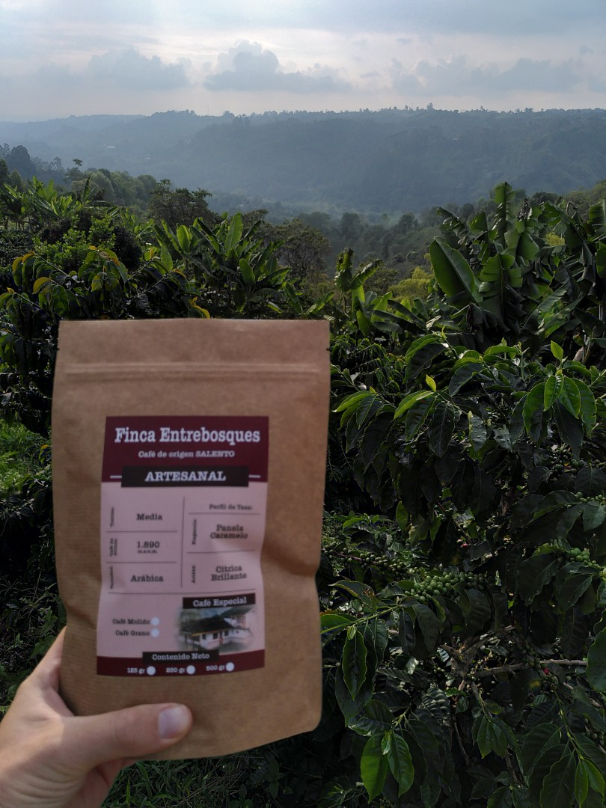
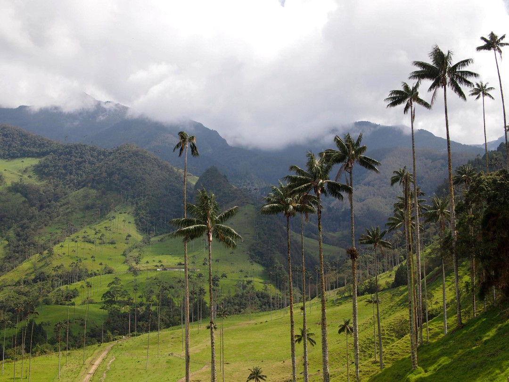
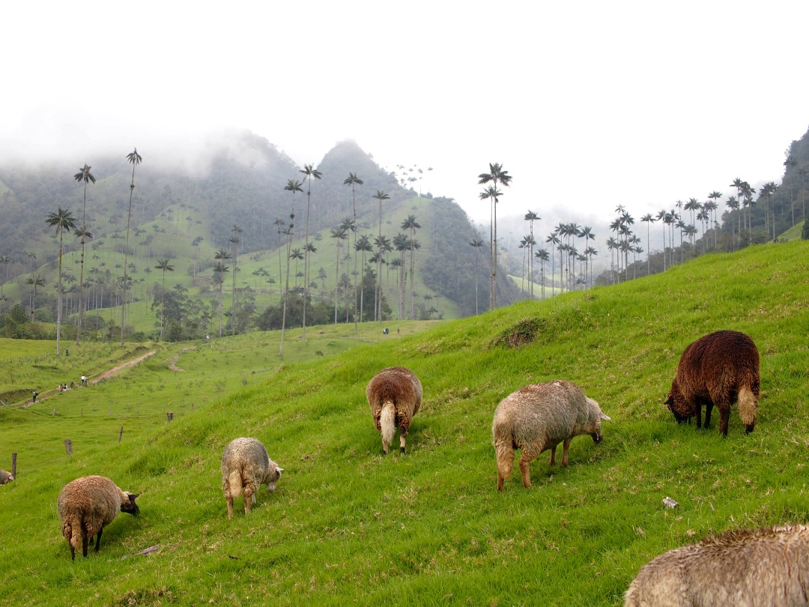
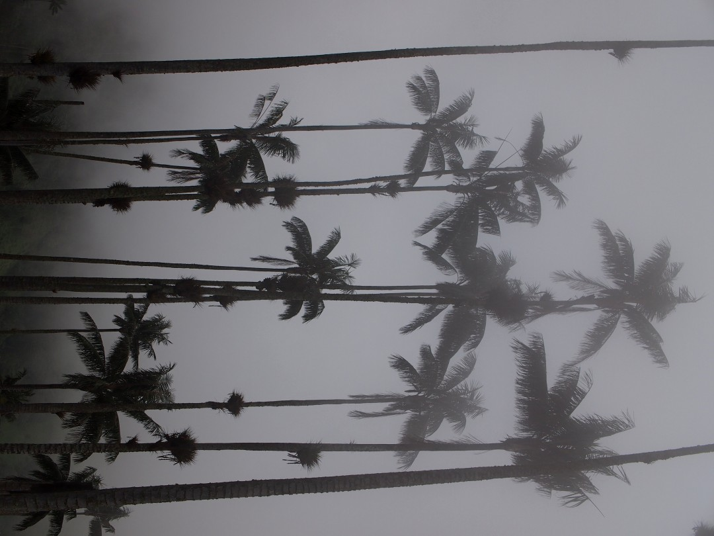

+++
title = "Coffee & Wax Palms"
date = 2025-02-14
authors = ["Julian"]

[extra]
location = [4.636576812865786, -75.47660311166159]
+++

On our weekend off at the Finca in Ibagué, we hopped on the public bus to visit the nearby town of Salento.
The highland region between Cali, Medellin and Bogotá is widely know as the _coffee triangle_ of Colombia, so of course we took the chance to visit a local _finca_ that organically grows and processes the beans.

We learned a lot about the entire process from planting, maintaining and harvesting the different types of _arabica_ trees over drying and processing the beans to roasting and finally brewing a good cup.
Of course we also got to taste the end product and I liked it so much I had to buy some for the little Bialetti pot I'm travelling with :smile:

Another attraction that draws many tourists to Salento is the _Valle de Cocora_, a nearby green valley full of tall wax palms.

The valley was a beautiful place for a day hike, with sheep feeding in the sunny lower parts and foggy clouds creating a spooky atmosphere only a bit higher in altitude.
