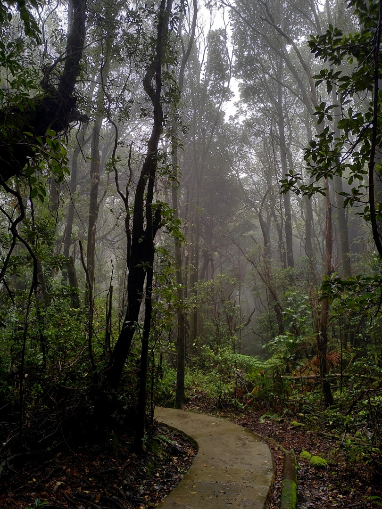
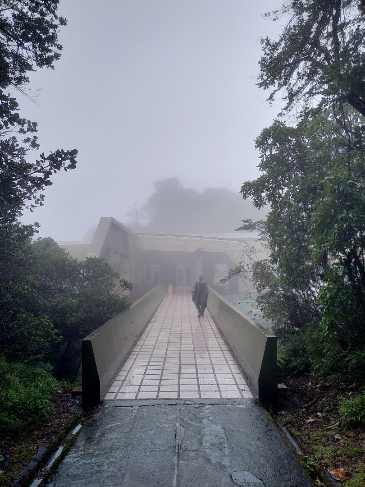
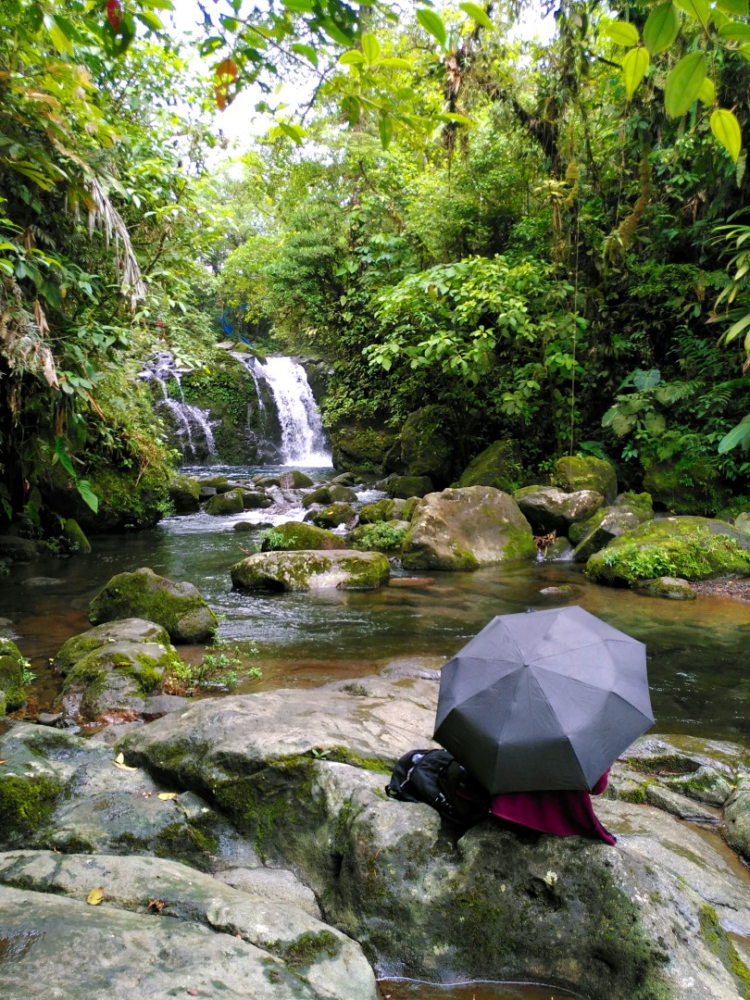

+++
title = "Rainy Cloud Forests"
date = 2025-03-20
authors = ["Julian"]

[extra]
location = [10.190428221191997, -84.23275613858529]
+++

We had a bit of bad luck with the weather in Costa Rica, which annoyed us especially given the cost of living in the country.
Not only were accommodations and entry to touristic attractions expensive even by European standards, basic food was almost not affordable either.
And then we ended up not seeing anything of the volcanoes we visited due to weather conditions - although I did quite like the cloud forests we walked through.

It gave us an opportunity to put our rain ponchos to good use and created an atmospheric scene for some nice photos.

In lower regions, the weather remained quite unpredictable.
At one point we took our swimwear to a series of beautiful natural pool leading up to a spectacular waterfall, only to enjoy the place under umbrellas again.
