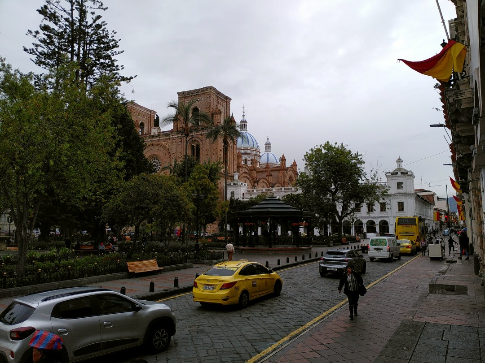
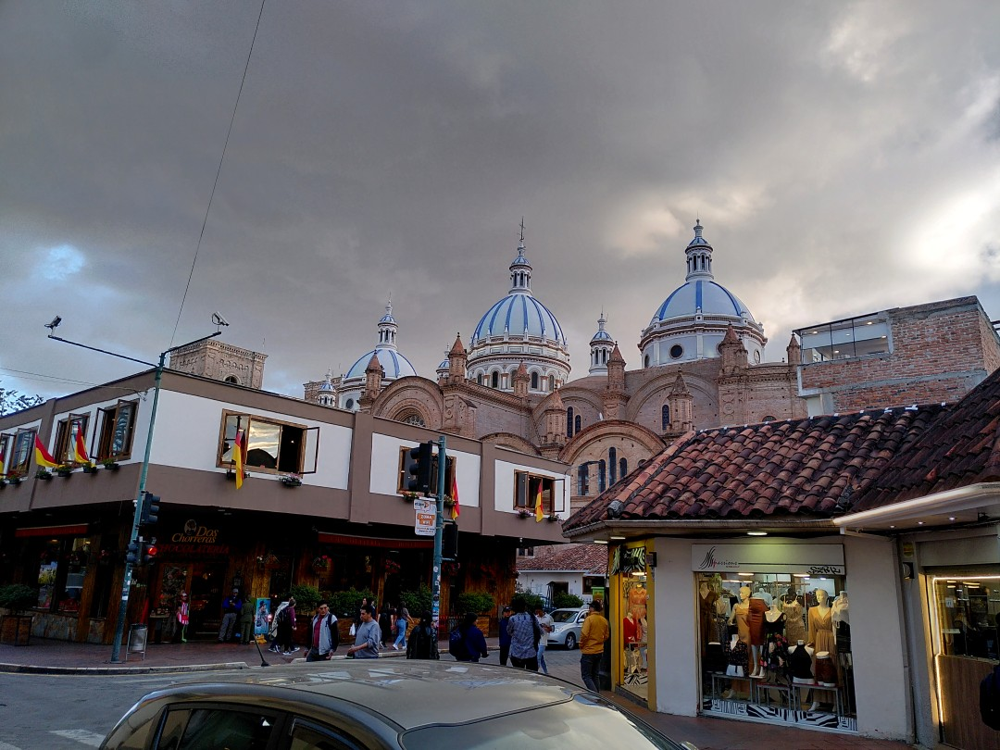
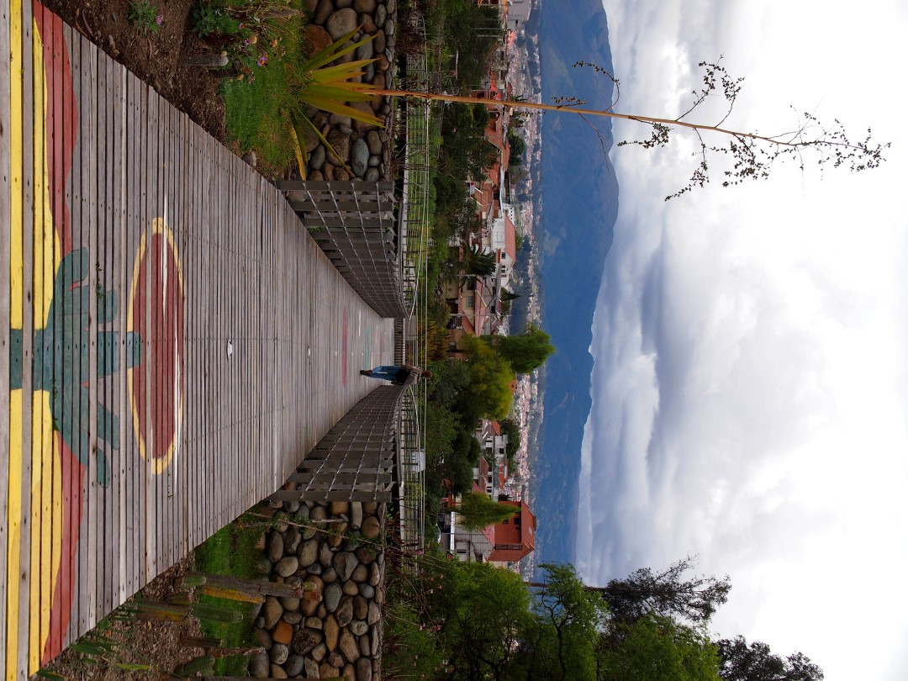
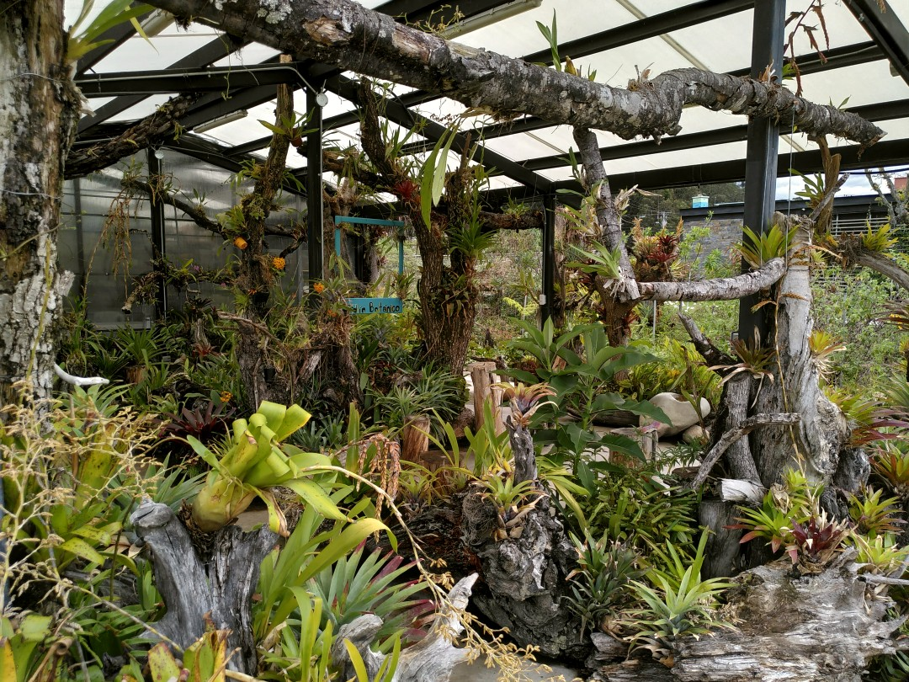
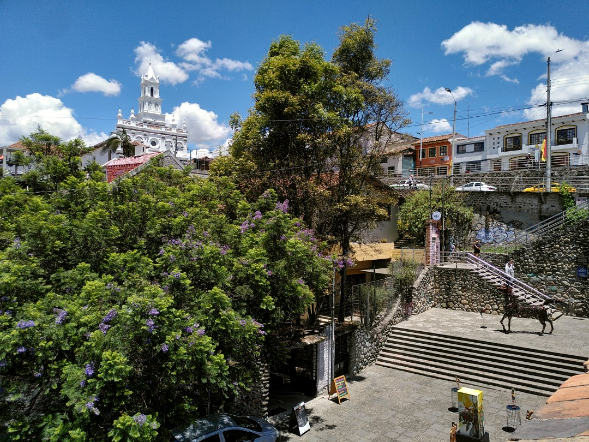
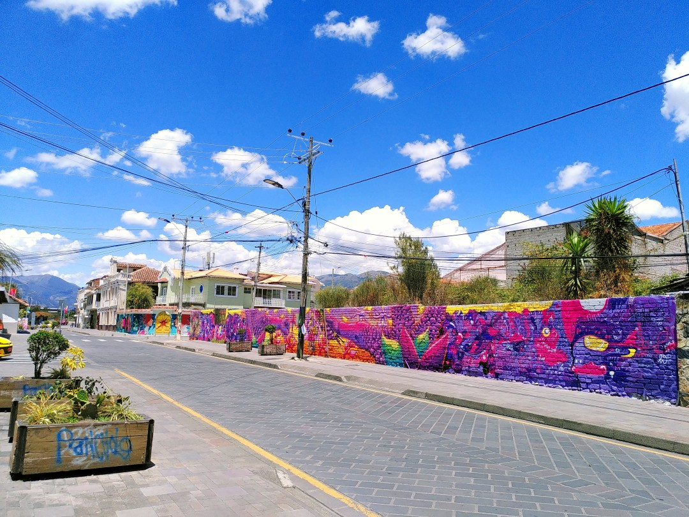

+++
title = "Entering Ecuador"
date = 2024-12-15
author = "Julian"

[extra]
location = [-2.89765, -79.004432]
+++

We crossed the border between Peru and Ecuador without issues and spent some days in the city of Cuenca.
It prominently features a big cathedral near the green _Parque Calderon_, even though it is hard to picture completely due to its proximity to neighbouring buildings.

As in any major city, we visited the botanical garden to escape the omnipresent traffic noises and enjoy the quiet between lots of beautiful plants.

However, Cuenca itself offers quite some nice spots, too.
Aside from the very green riverside and well maintained parks, various forms of art and music were on display at the old _Puente Rota_.
And in the (often sunny) streets, more colourful works of art can occasionally be found.
