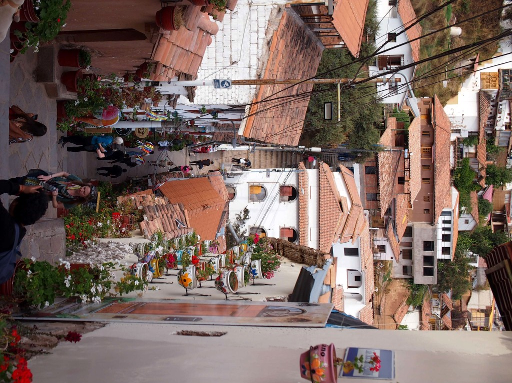
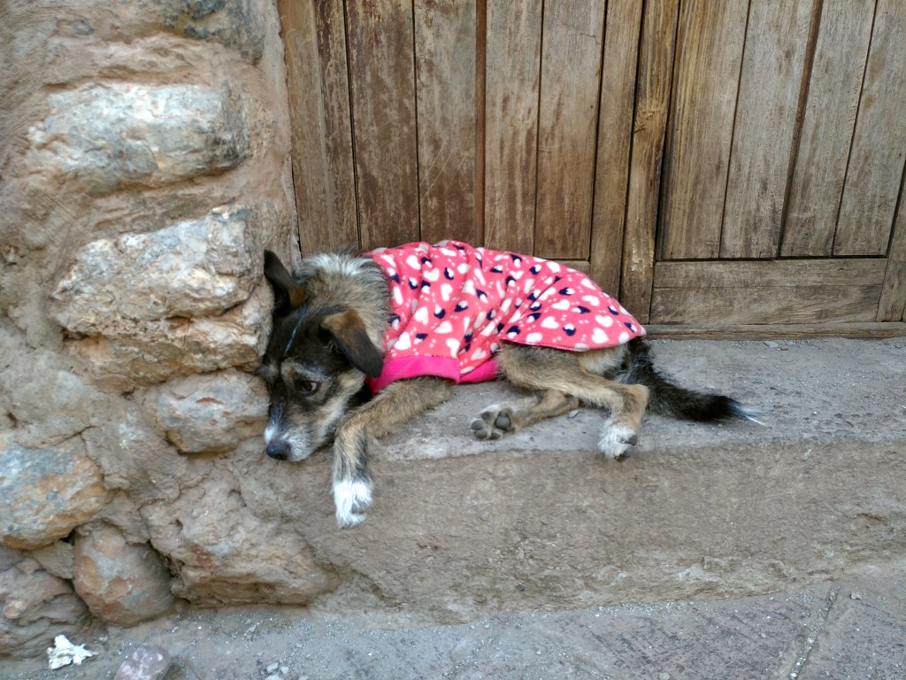
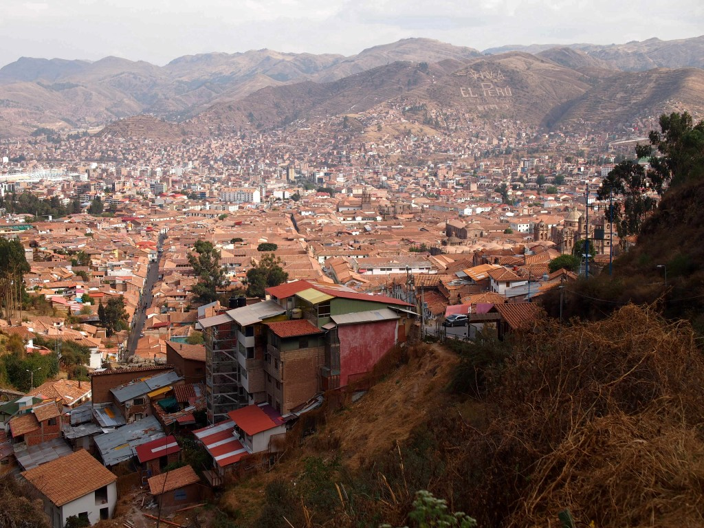
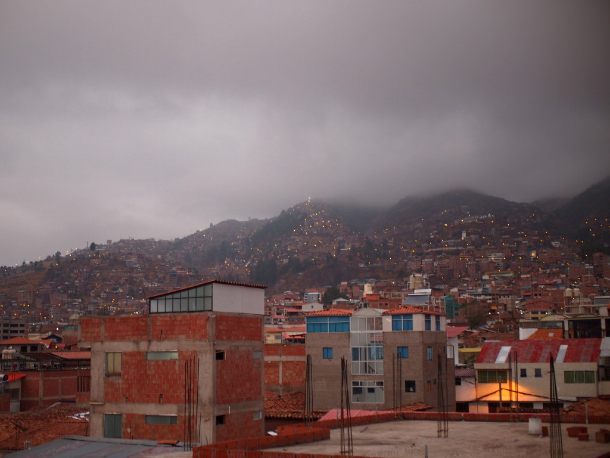
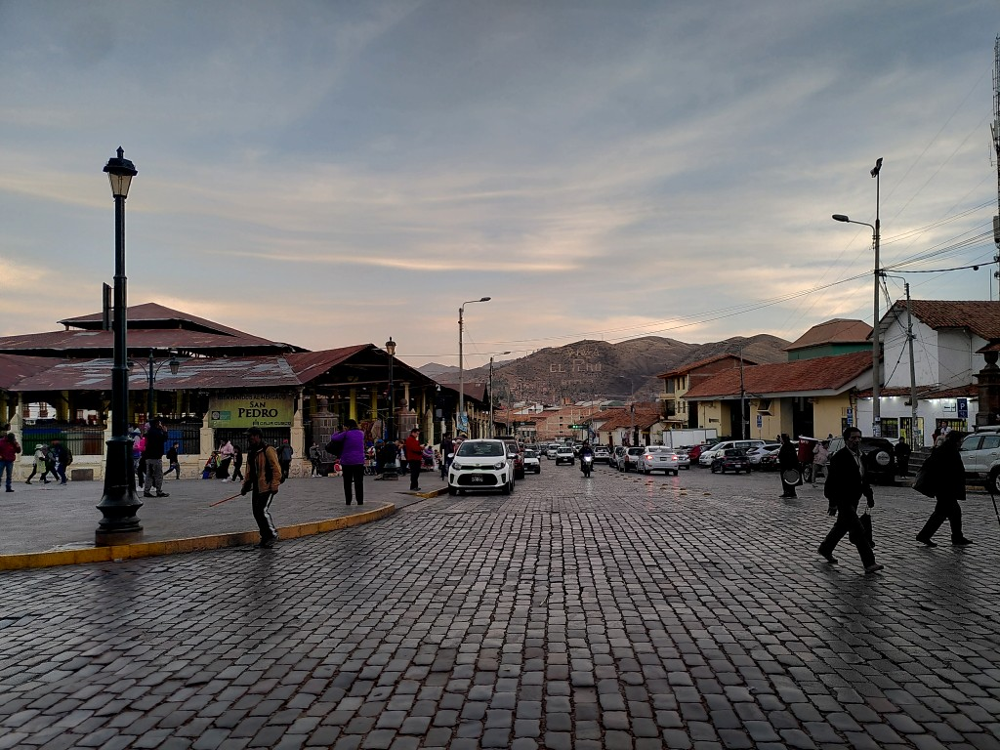
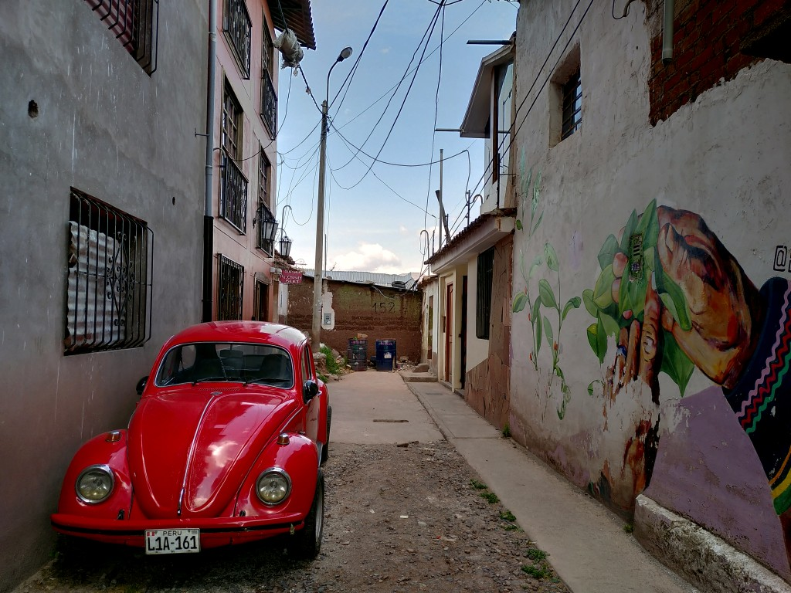

+++
title = "Streets of Cusco"
date = 2024-10-23
author = "Julian"

[extra]
location = [-13.5170887, -71.9785356]
+++

We started our journey in Cusco.
The center of the former Inka capital is full of historic buildings, narrow streets and sleepy dogs.

It's also surrounded by some ancient ruins and the Andes of course, meaning there's no lack of places to look over the roofs of the city.

A major hotspot is the _Mercado San Pedro_, a market offering everything from fresh fruit juice over colourful sweatshirts and bread to raw meat.

Among the rather busy traffic, an remarkably high number of old Volkswagen can be found.
According to [Wikipedia](https://de.wikipedia.org/wiki/VW_K%C3%A4fer), in Latin America the model has been built until 2003.
