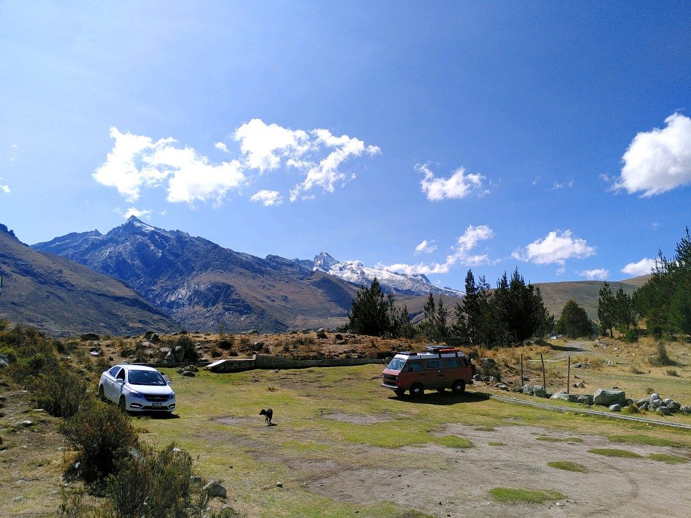
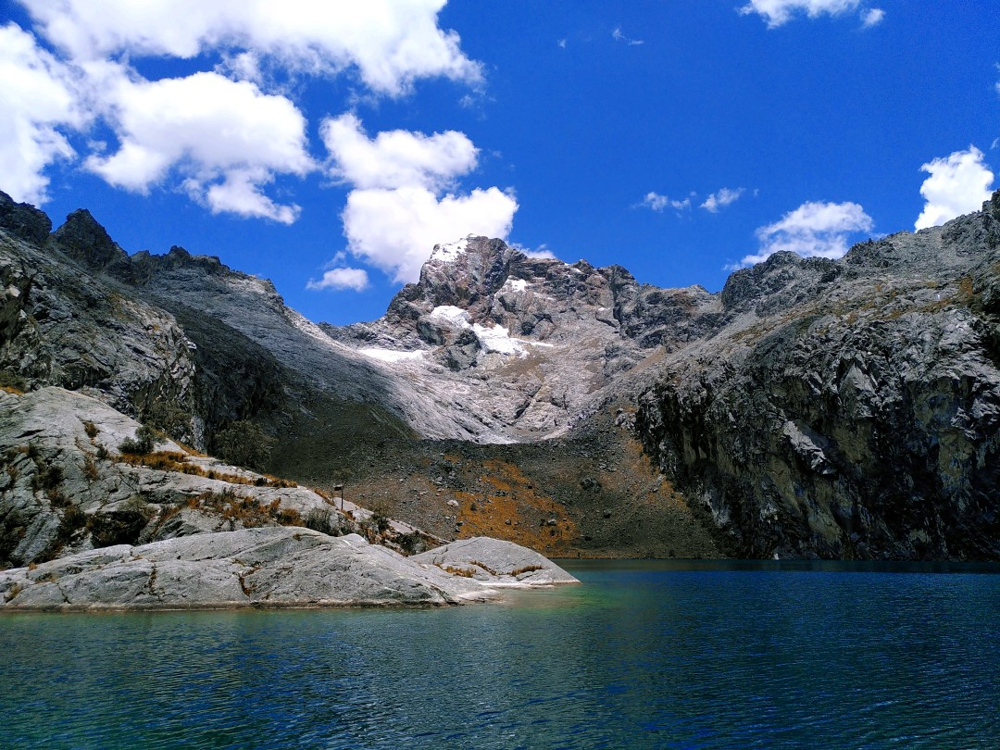
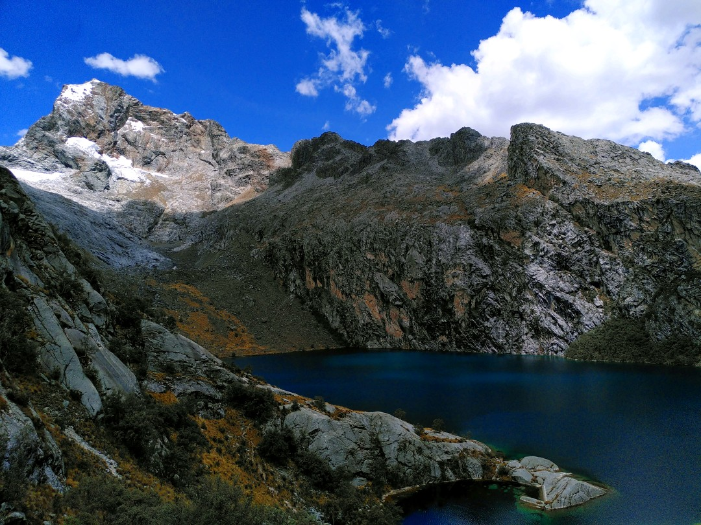
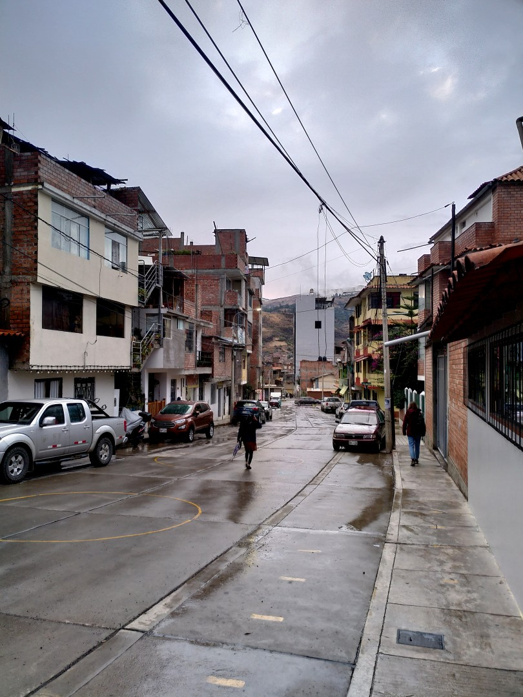
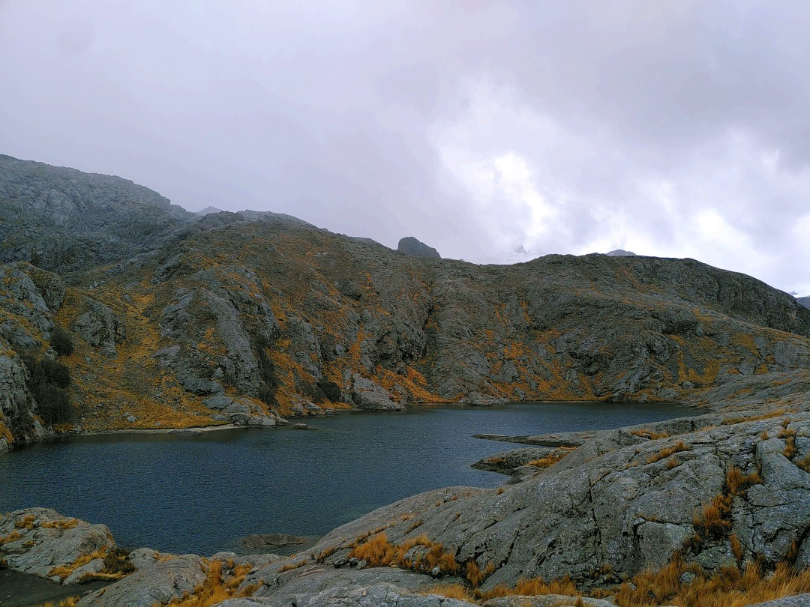

+++
title = "Lagoons around Huaraz"
date = 2024-11-23
author = "Julian"

[extra]
location = [-9.485717626667862, -77.43173595138371]
+++

From Lima, we took the night bus up north to the small Andean town of Huaraz.
By some of the many small buses serving as public transport in all directions, amazing panoramas can be reached in under one hour of bumpy rides.

Even better views of blue lagoons like the _Laguna Churup_ above can be achieved via day hikes up the mountains.

Weather can be hard to predict in the high mountains though and hiking in altitudes well over 4000 meters is noticably harder than at sea level.
So sometimes you may end up like us, finding the nice lagoon after a tiring climb in grey clouds, sharp winds and icy rain, catching a cold instead of nice pictures.
