+++
title = "Cocoa Farming"
date = 2025-01-26
author = "Julian"

[extra]
location = [4.472565991980901, -75.12383306523022]
+++

Since we both love good chocolate and wanted to learn more about both the chocolate production process and life in Colombia, my girlfriend and me volunteered at a _Finca_ near Ibagué in December.
The small, organic chocolate business was run by Luis, a former school teacher and his family - which appeared to consider us members of it as well from the very minute we arrived, as they were always very concerned with our well-being and seemed to enjoy our company as much as we did theirs.

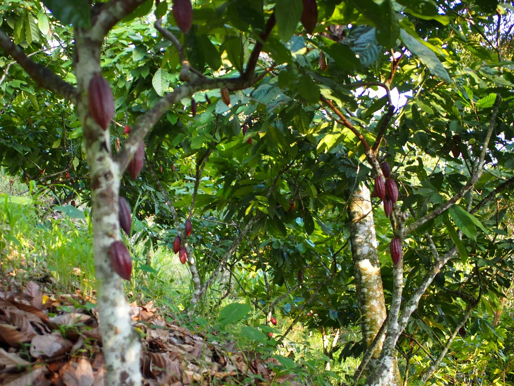
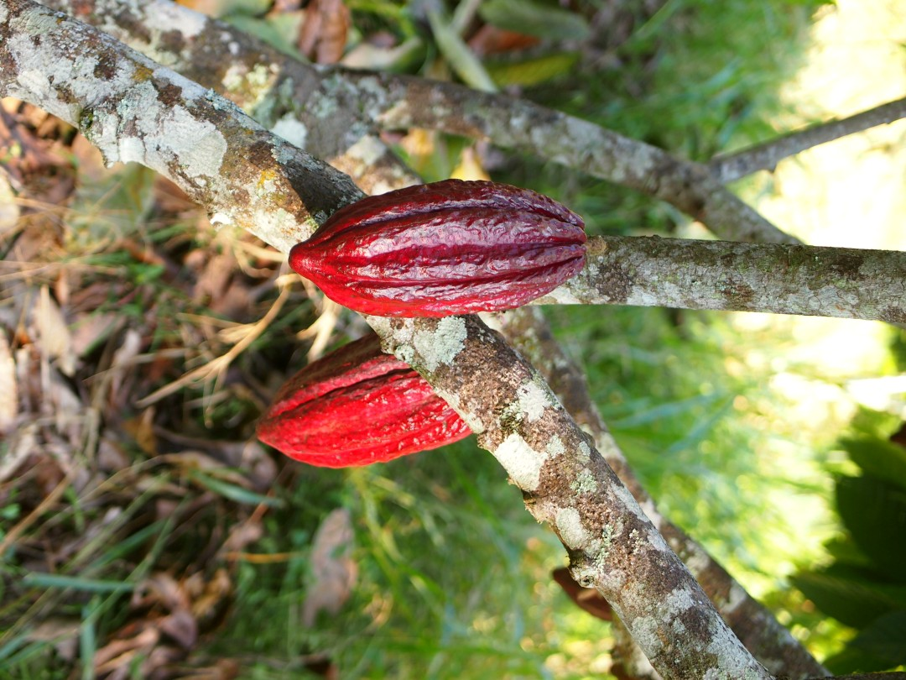
The finca mainly consisted of a house inhabited by Luis' brother in law Oscar with his wife Nancy, some guest rooms and a good amount of hilly forest.
With Oscar's son Oliver as an expert in forest biology and cocoa plantation, the group had considerably reforested the property with both different varieties of cocoa and other (native) trees, creating a syntropic system allowing them to grow and harvest the cocoa without any use of synthetic fertilisers, insecticides or other major, unsustainable disruptions of the local ecosystem.

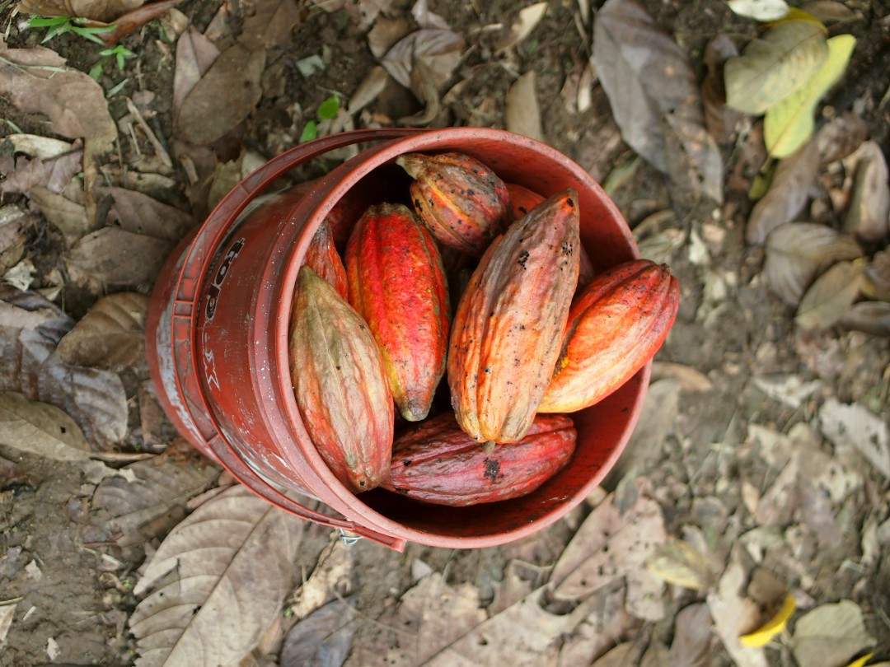
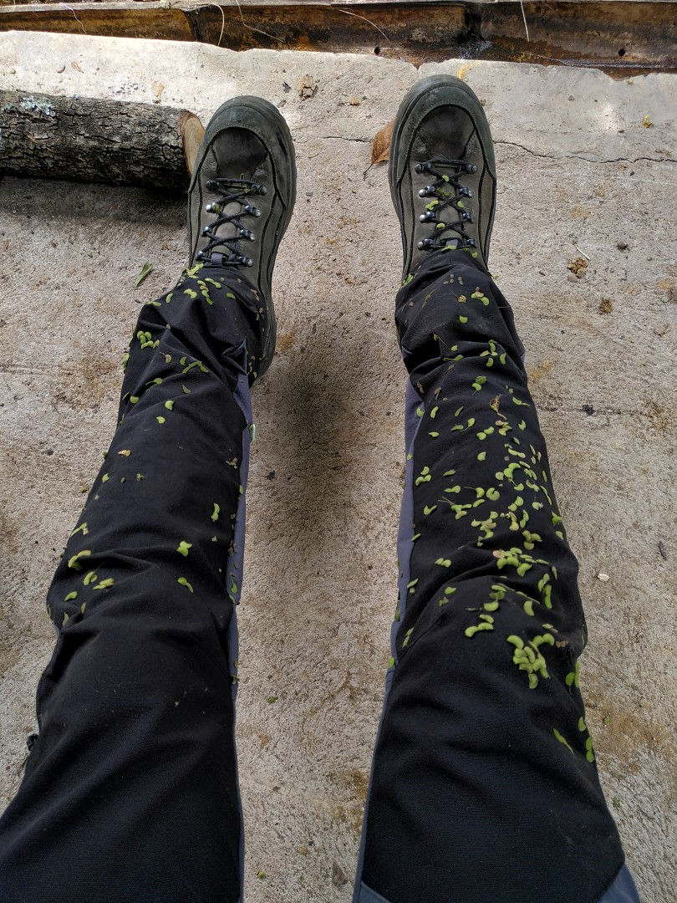
We arrived just in time for the cocoa harvest, which can take place twice a year (depending on the variety of cocoa tree).
We learnt to tell ripe fruits from immature ones and had a lot of sweat and fun navigating the sometimes challenging forest terrain in tropical climate.
In the afternoon we would always end up with our clothes covered in velcro-like grass seeds :D

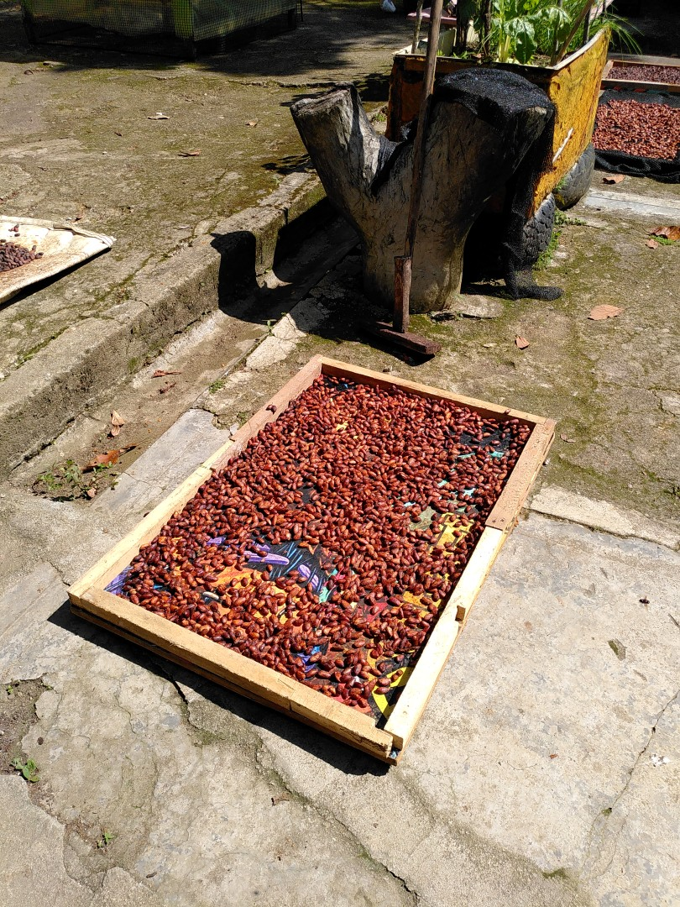
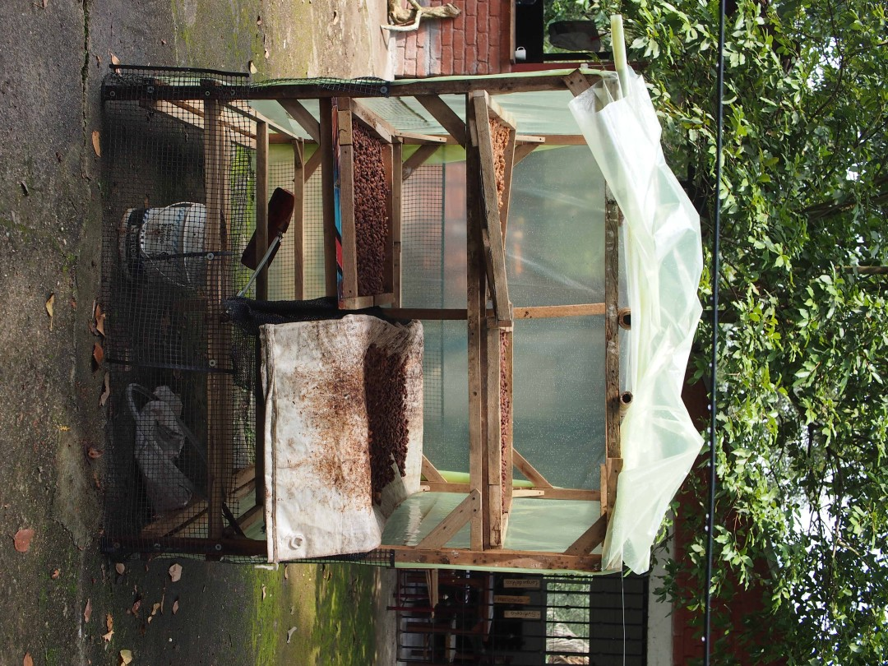
After opening the the fruits and extracting the beans, they need to ferment for two days in a leaf-covered bucket and then dry in the sun.

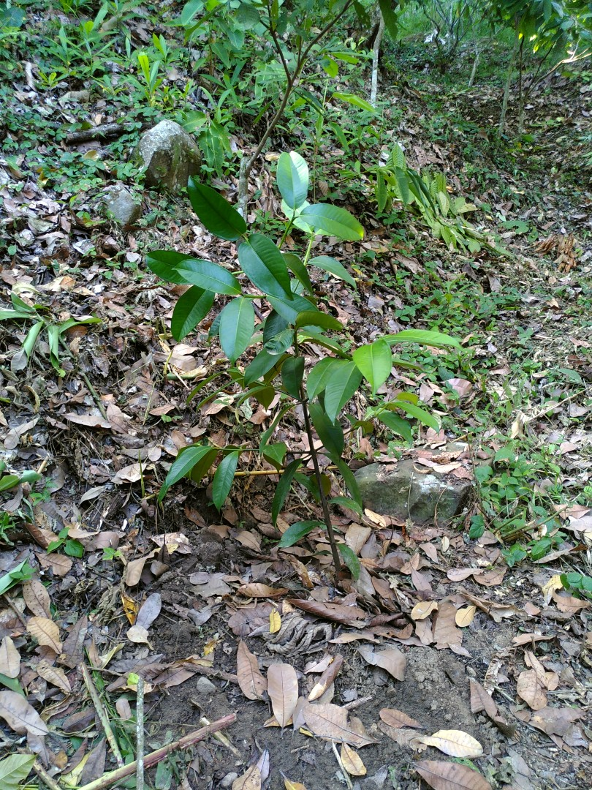
Besides harvesting cocoa and cutting excess branches from the trees, we also planted new ones - here's one of two young mangostan trees at its new home.

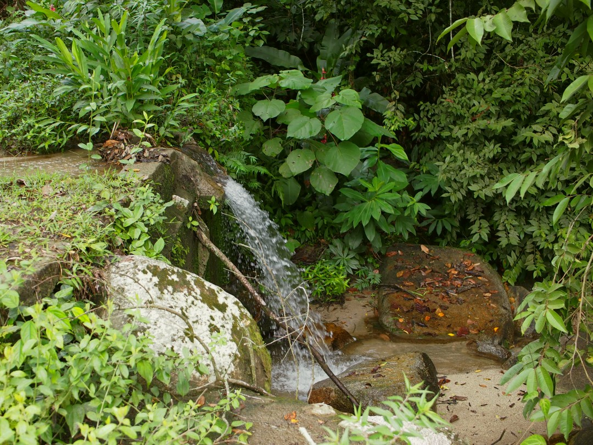

After a sweaty day in the forest, we would often cool down in the little waterfall produced by the brook at the lower part of the property, right next to a huge, flowering heliconia plant.

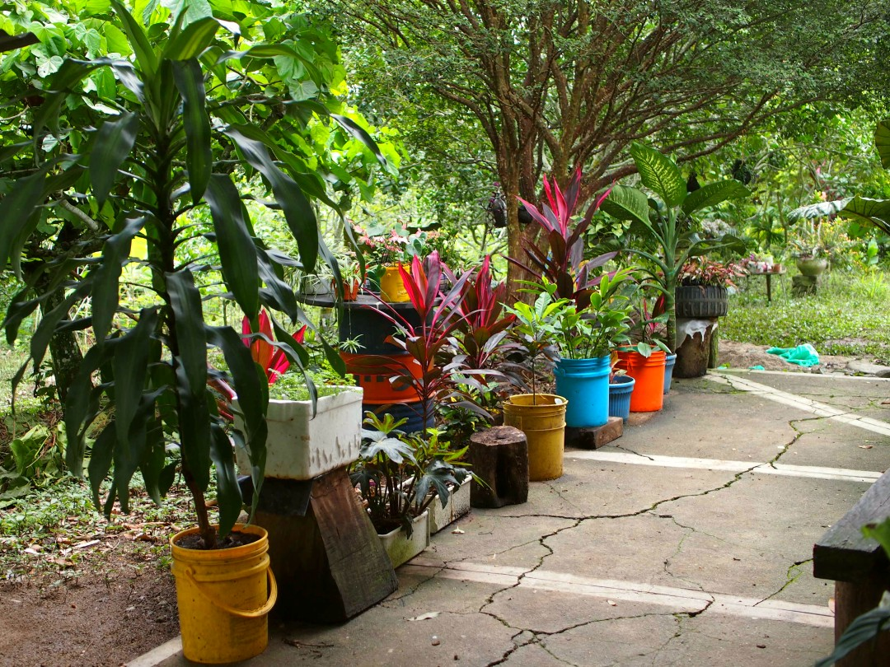
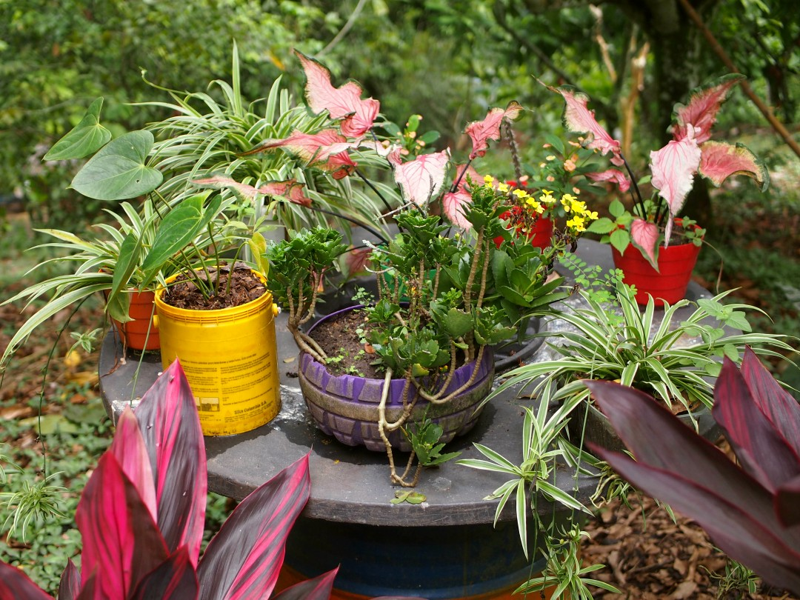
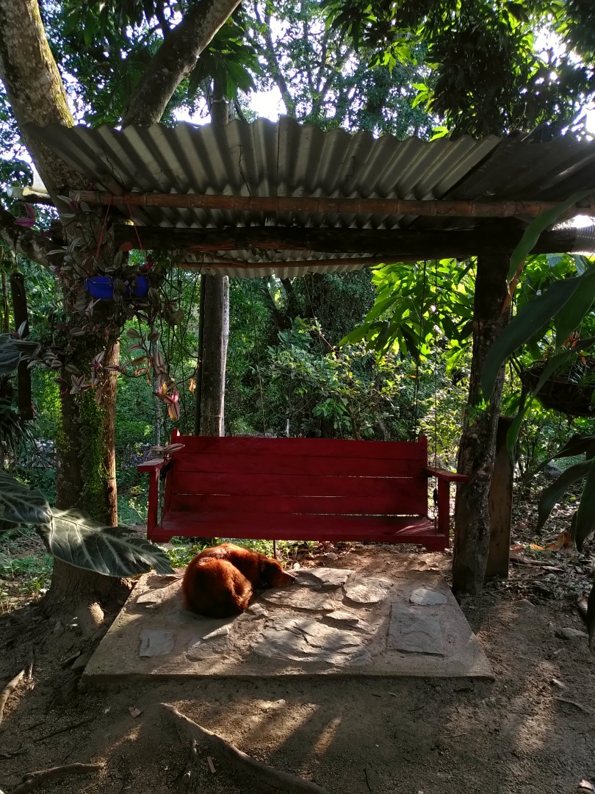
Not only because waste disposal is not trivial in rural Colombia, the inhabitants of the finca fondly recycled both all kinds of materials as well as seeds or saplings to decorate the grounds.
Luna the dog didn't care a lot about plants, but seemed to appreciate her favourite spot under the suspended wooden bench!
