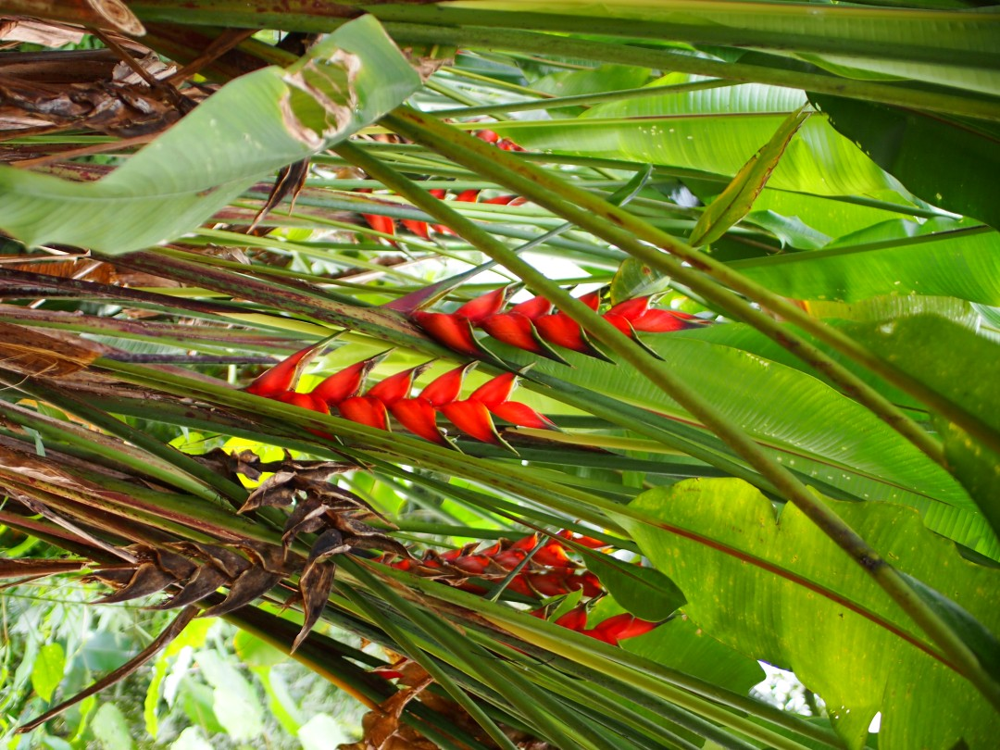

+++
title = "Cocoa Farming"
date = 2025-01-26
author = "Julian"

[extra]
location = [4.472565991980901, -75.12383306523022]
+++

Since we both love good chocolate and wanted to learn more about both the chocolate production process and life in Colombia, my girlfriend and me volunteered at a _Finca_ near Ibagué in December.
The small, organic chocolate business was run by Luis, a former school teacher and his family - which appeared to consider us members of it as well from the very minute we arrived, as they were always very concerned with our well-being and seemed to enjoy our company as much as we did theirs.

The finca mainly consisted of a house inhabited by Luis' brother in law Oscar with his wife Nancy, some guest rooms and a good amount of hilly forest.
With Oscar's son Oliver as an expert in forest biology and cocoa plantation, the group had considerably reforested the property with both different varieties of cocoa and other (native) trees, creating a syntropic system allowing them to grow and harvest the cocoa without any use of synthetic fertilisers, insecticides or other major, unsustainable disruptions of the local ecosystem.

