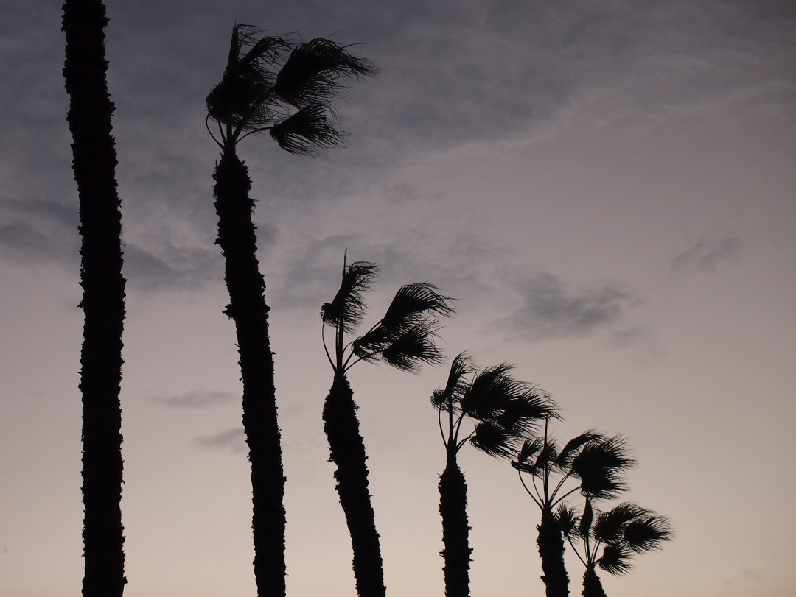
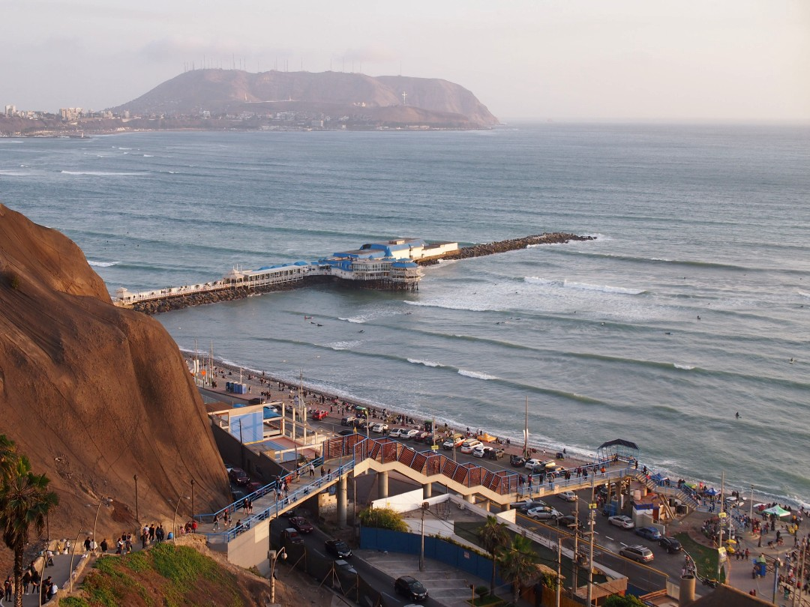
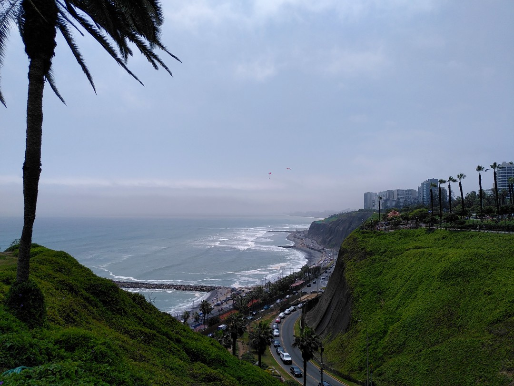
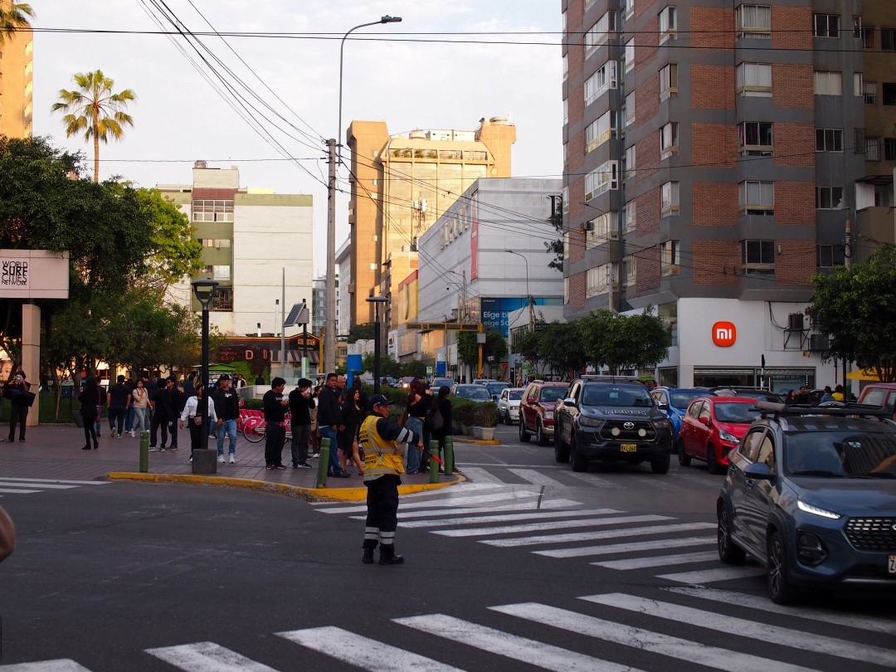

+++
title = "Back in Lima"
date = 2024-11-18
author = "Julian"

[extra]
location = [-12.121731781226732, -77.03036949964373]
+++

Since we lived in Lima 7 years ago for a couple of months, we stopped by to meet some friends.

We enjoyed the neighbourhoods of _Miraflores_ and _Barranco_ right by the sea and went surfing at _Playa Makaha_, of course.

However, public transport via a convoluted system of various buses in the city that's home to a third of all Peruvians is still cryptic to me.
With all the hectic traffic and almost nowhere to escape the constant noise of horns and combustion engines, I was not sad to leave again (even though we did have a great time with everyone we met).
