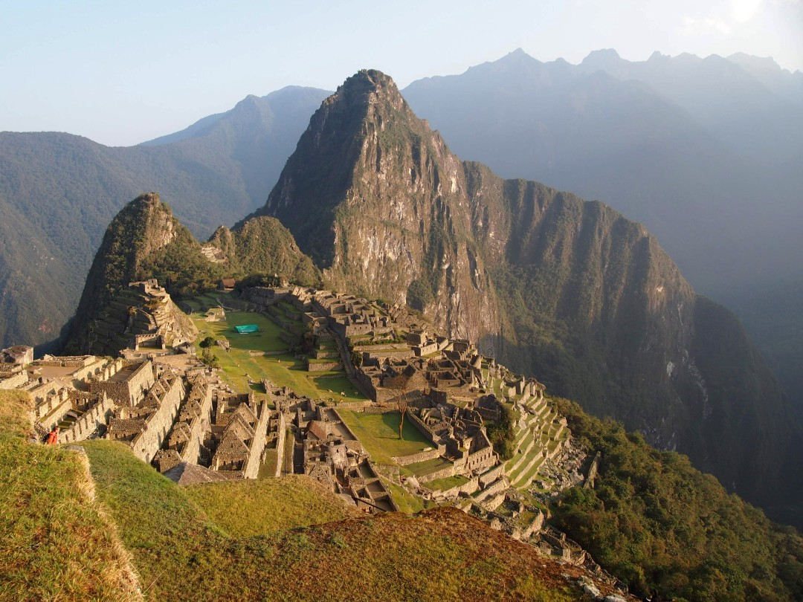
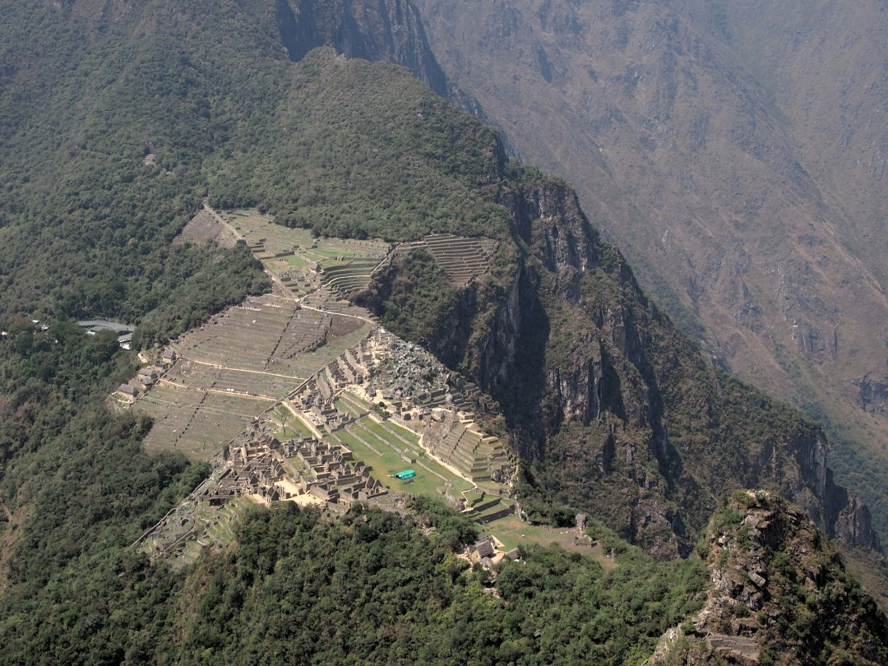
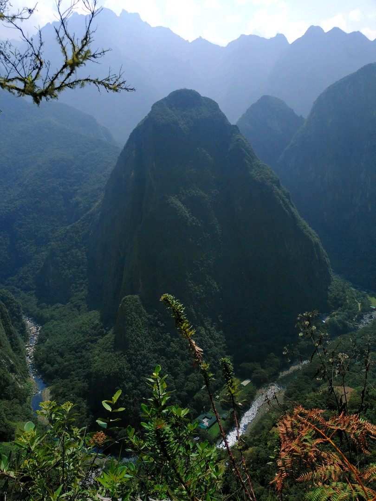
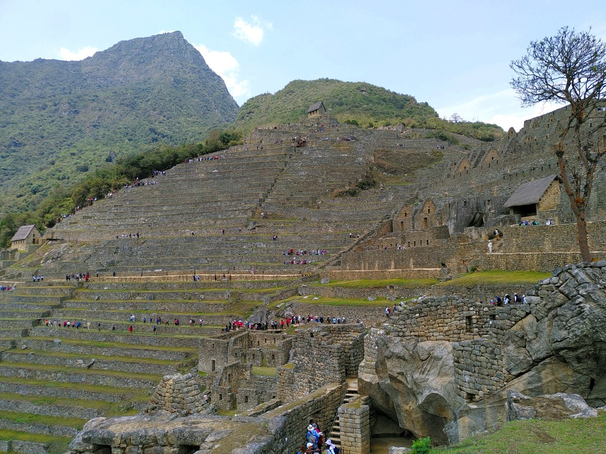

+++
title = "Machu Picchu"
date = 2024-11-10
authors = ["Julian"]

[extra]
location = [-13.162746747646858, -72.54544152488509]
+++

We started our ascend to the Inka ruins of Machu Picchu at 05:00 in the morning, such that we got to the famous citadel right at sunrise.

Technically, _Machu Picchu_ (Quechua for "big mountain") is the name of the mountain the site is built on.
We also had the opportunity to climb _Wayna Picchu_ (Quechua for "little mountain"), the rock visible in the back of the picture above.

Aside from the impressive remains of Inka architecture, the panorama of the place itself is stunning in every direction.

Even though the site can get very crowded with visitors, I think it's absolutely worth a visit.
