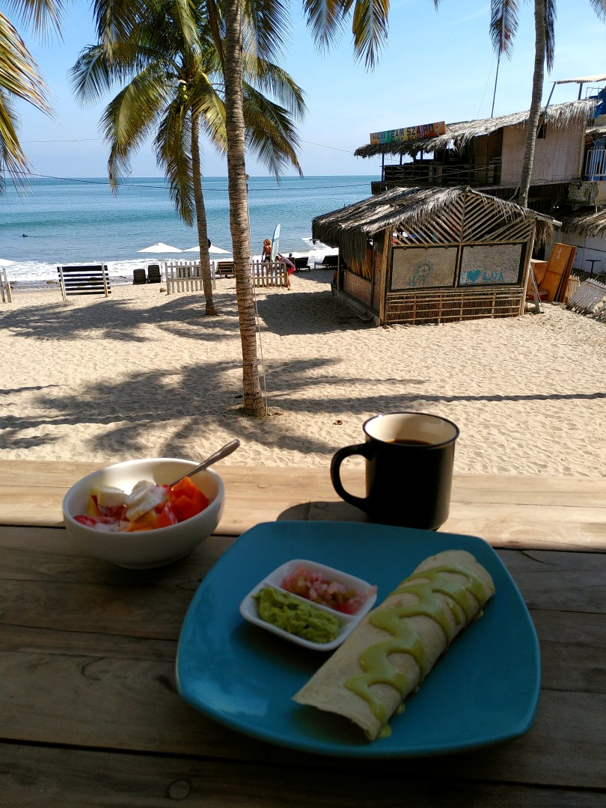
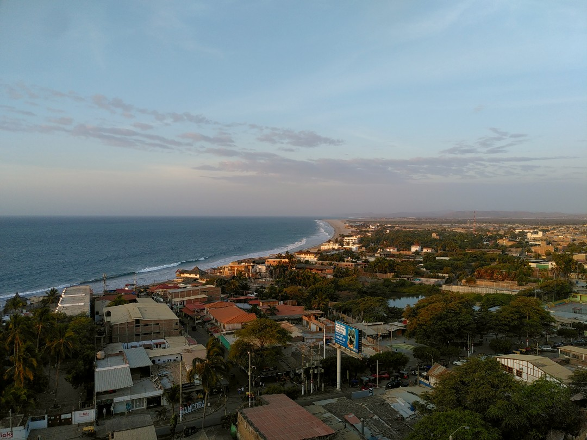
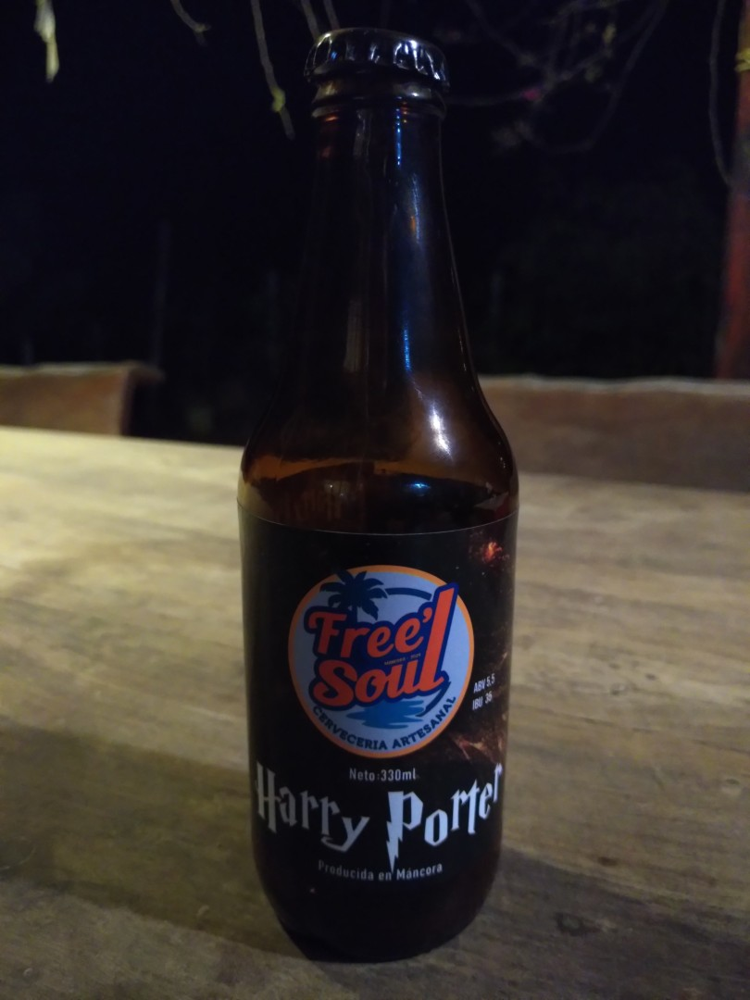

+++
title = "Beach Life in Mancora"
date = 2024-12-06
author = "Julian"

[extra]
location = [-4.1064636030187485, -81.05815076230022]
+++

On our way to Ecuador, we stopped in Mancora to visit a friend. We treated us a perfect breakfast right at the beach - I think it doesn't get much better than sharing stories with lovely people over delicious food at a calm, sunny seaside place.
We also enjoyed a fun surfing session in warm waves (finally!) full of fish.

Before leaving in the evening, we let the day fade out together at Mancora's lighthouse with a good view and tasted some of the beer our friend brews himself locally.
