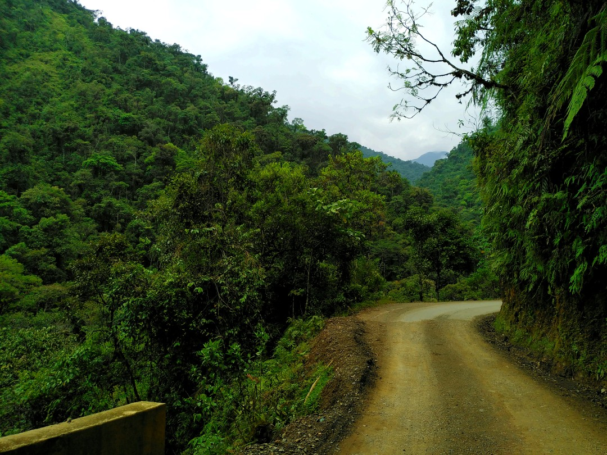
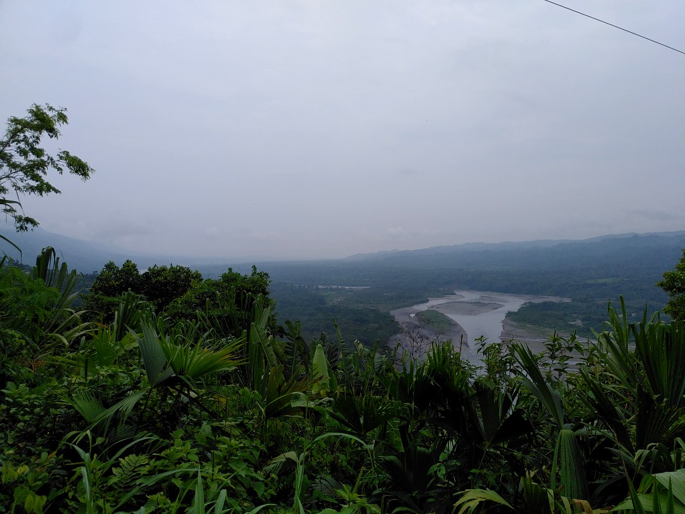
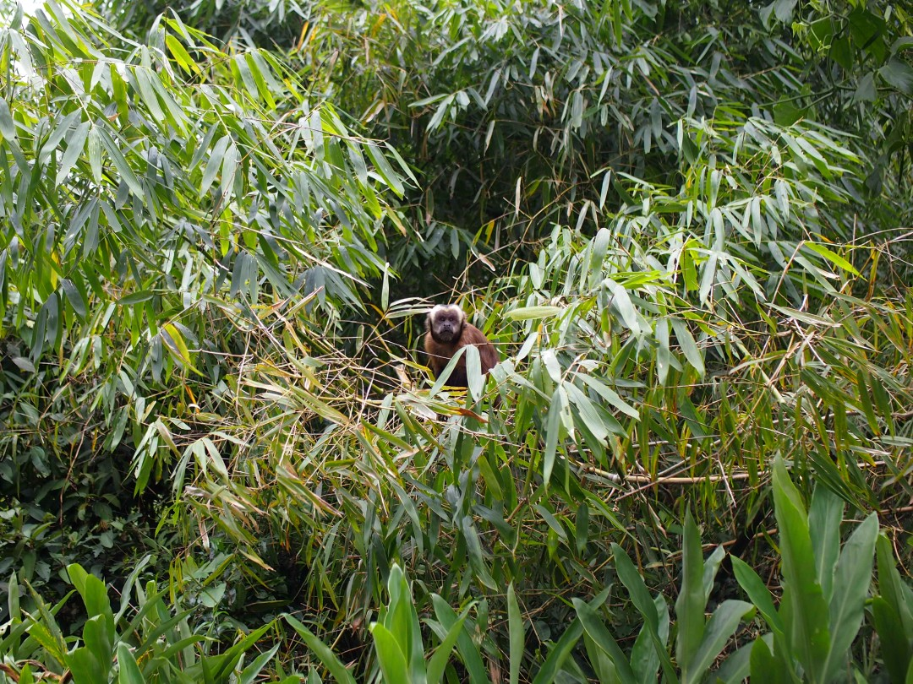
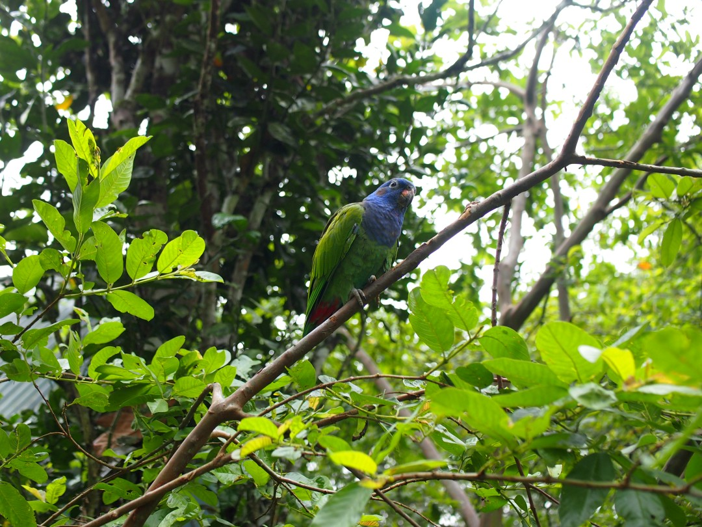
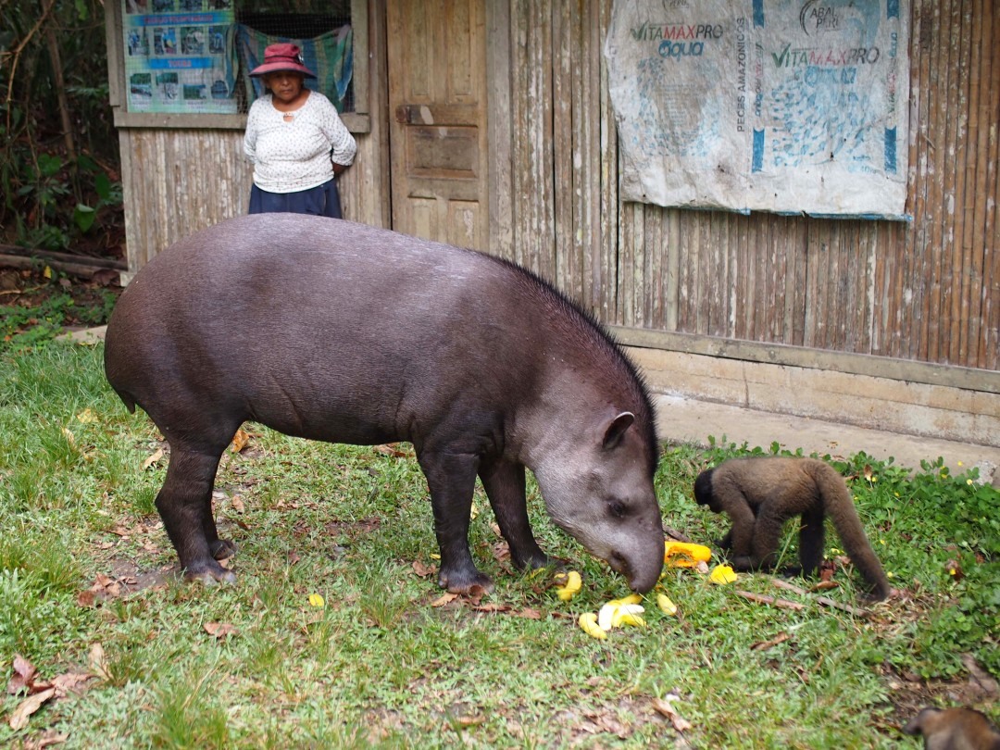

+++
title = "Into the Jungle"
date = 2024-11-12
author = "Julian"

[extra]
location = [-12.85594732459084, -71.38362272872213]
+++

We went on a tour by car and boat into the lower jungle of the Manu national park from Cusco.

Thanks to our very enthusiastic guide, we got to see a lot of wildlife - like this capuchin monkey watching us likewise.

Along the road, we encountered many beautiful birds.
Most of them were out of reach for our cameras, though.

We also met two friendly tapirs.
The massive animals don't mind humans (or other monkeys) around them and even enjoy getting petted.
This one is sharing a meal of fruits with a young woolly monkey in an animal sanctuary we passed.
