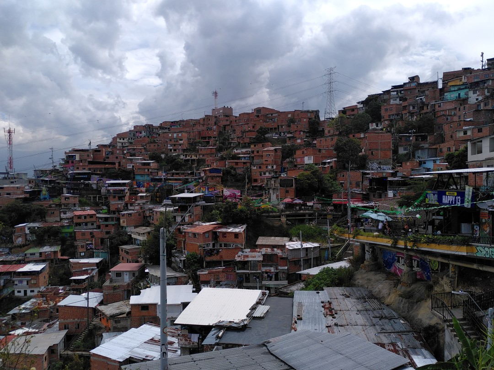
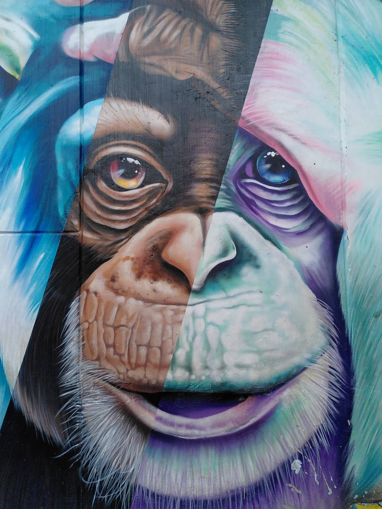
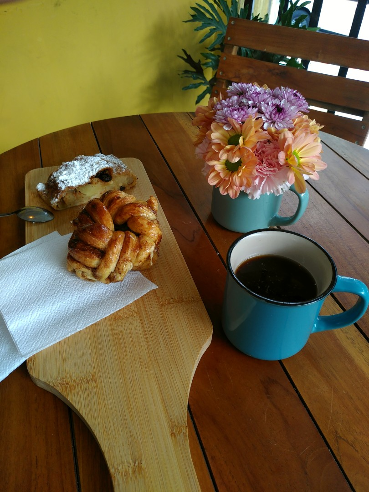

+++
title = "Contrasts in Medellín"
date = 2025-02-18
authors = ["Julian"]

[extra]
location = [6.257431522662128, -75.61453189731441]
+++

Medellín's infamous _Comuna 13_, a neighbourhood formerly known for its violent history of gangs, guerilla groups, drug trafficking and brutal police raids, is a major tourist attraction today.
Its integration with the remainder of the city often seen as a leading example of urban development in South America.

After the barrios' residents finally found peace, they now proudly showcase their talent for rap, DJing, breakdance and colourful street art.

At the other end of town, we found an original German bakery amid all the (from a spoilt European perspective) rather questionable baked goods.
We enjoyed some really delicious pastries and happily left with some fresh pretzels as well as a nice, heavy wholegrain bread.
