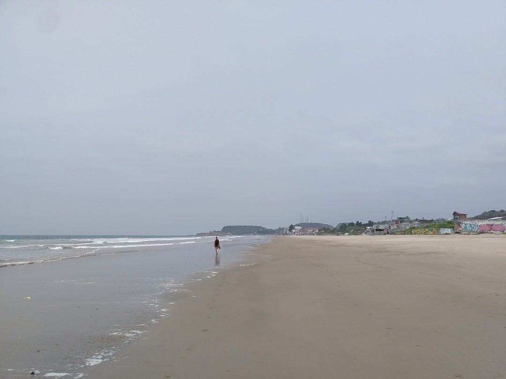
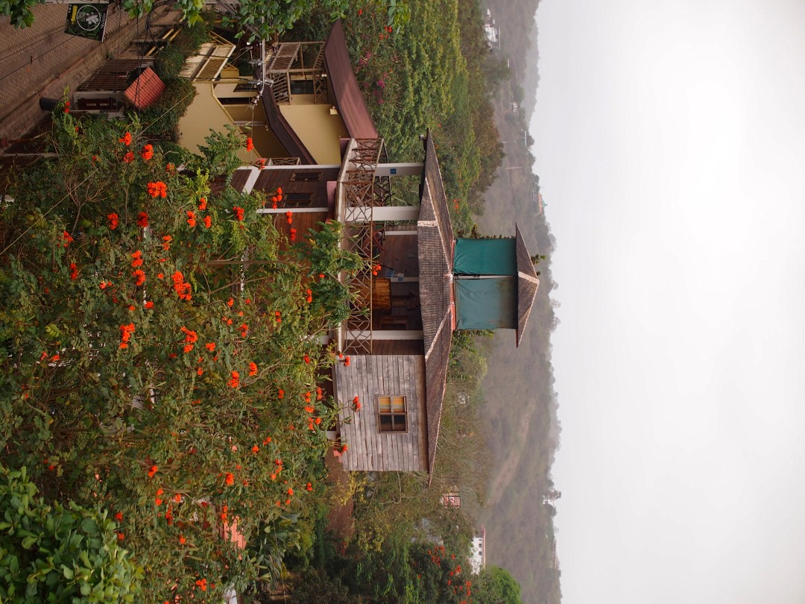
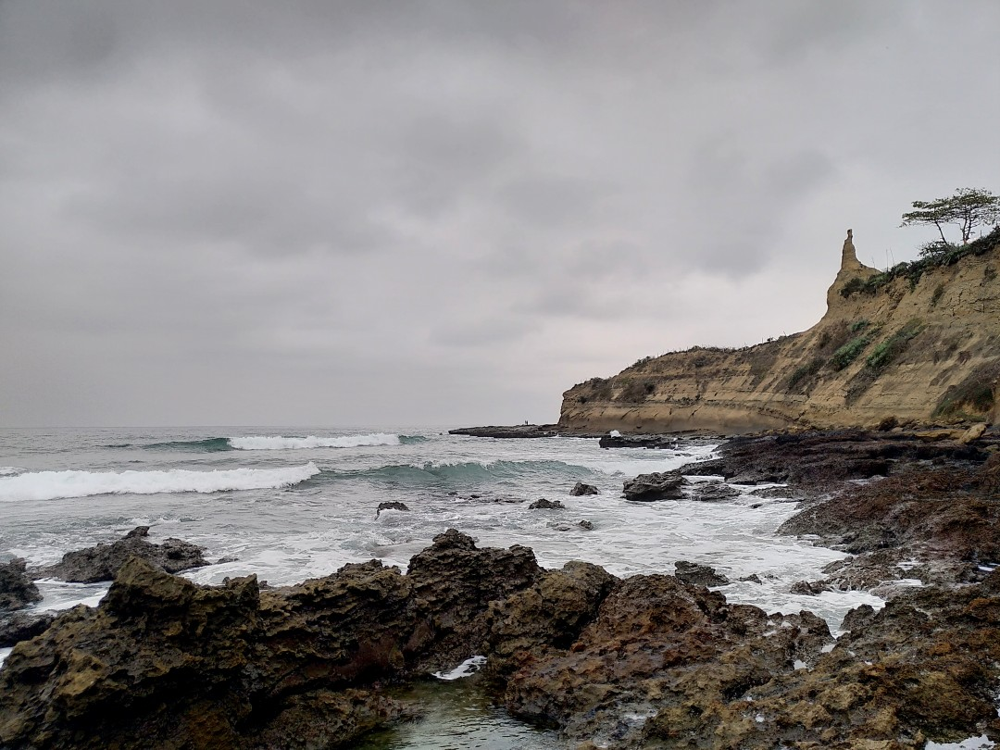
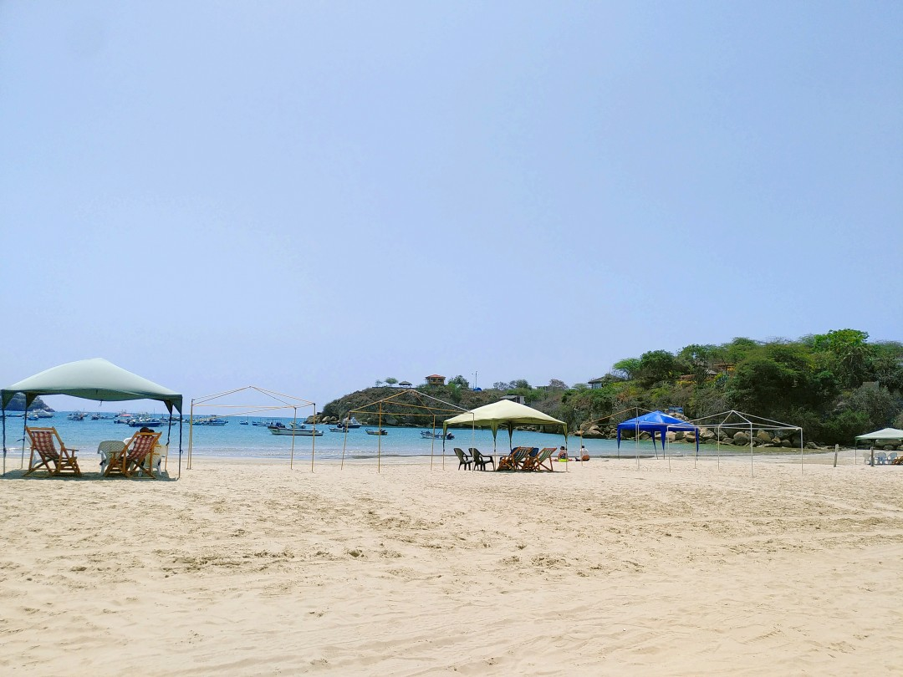
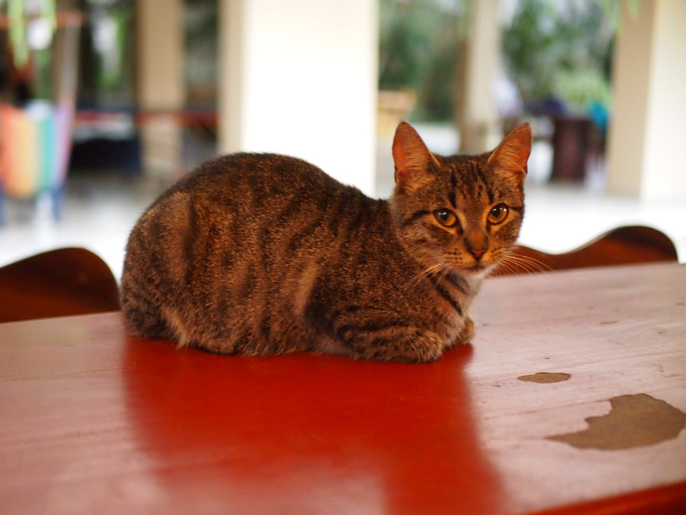
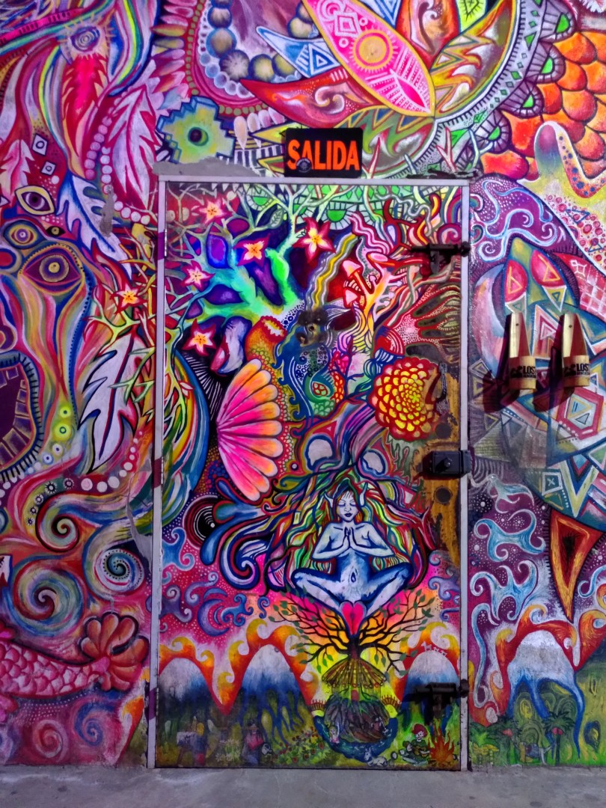

+++
title = "Beach Life"
date = 2024-12-30
author = "Julian"

[extra]
location = [-1.8246418086982084, -80.75517332133711]
+++

In exchange for accommodation, we volunteered in a hostel in the small town of Montañita, where the jungle meets the Pacific ocean.

Since work was not that hard and it was rather low season in November, we had plenty of time to our disposal.
Naturally we surfed the beach break in front of our door a lot - even though most days were cloudy, both water and air were warm enough to enjoy a session in a thin shorty or even just boardshorts.

A friend also took us snorkeling at a microscopic "island" off a boat from the beautiful _Playa de Ayangue_.
We swam with multiple turtles, seals, pufferfish and lots of other colourful creatures!

Of course we befriended some of the very cute local cats of the hostel, to the effect of suffering from a slightly broken heart when we left and had to leave them behind.

Aside from salsa, reggaeton and traditional music in the streets and bars, Montañita is home to the prominent _Lost Beach Club_, which combined decent tech house and melodic techno with very colourful murals all over the (quite large) complex when we visited.
