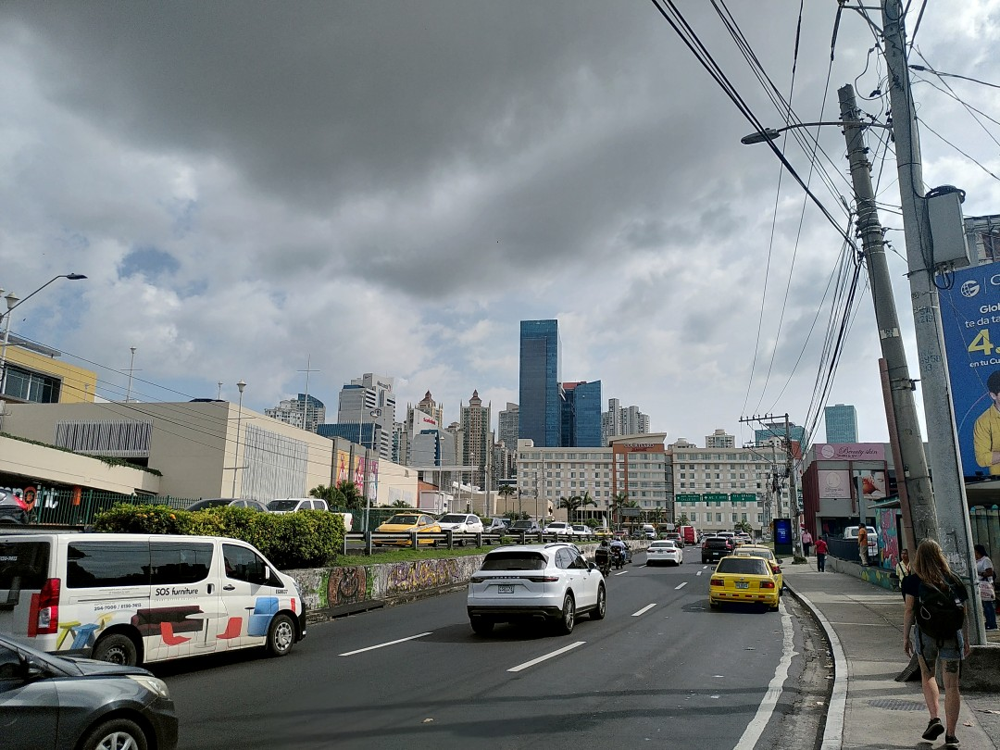
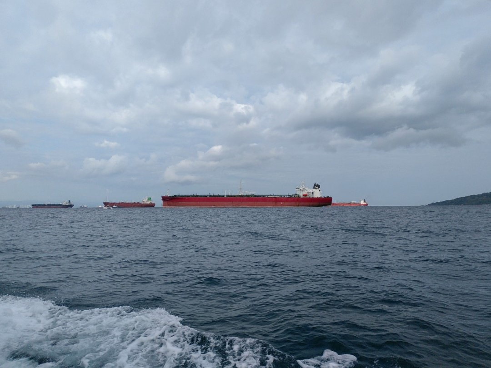
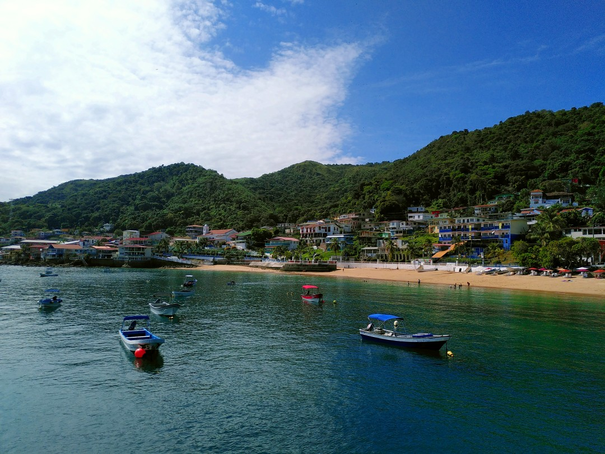
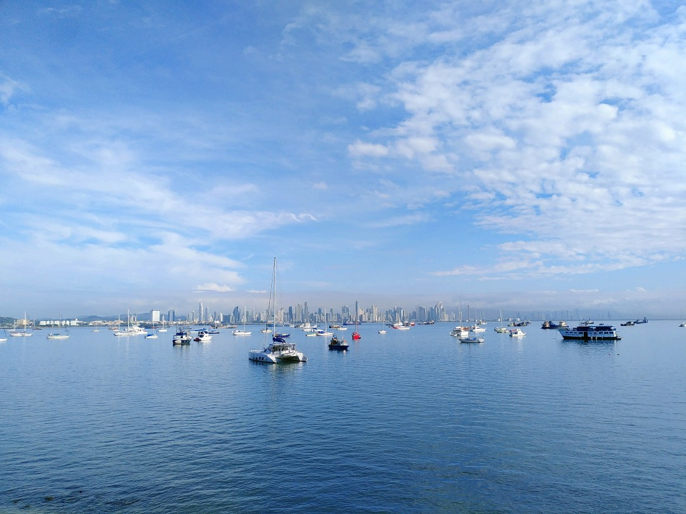
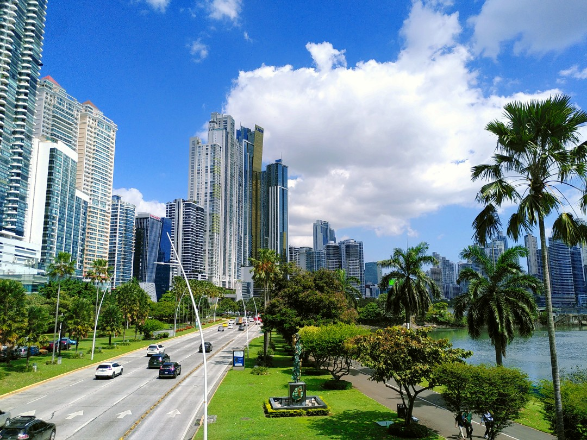
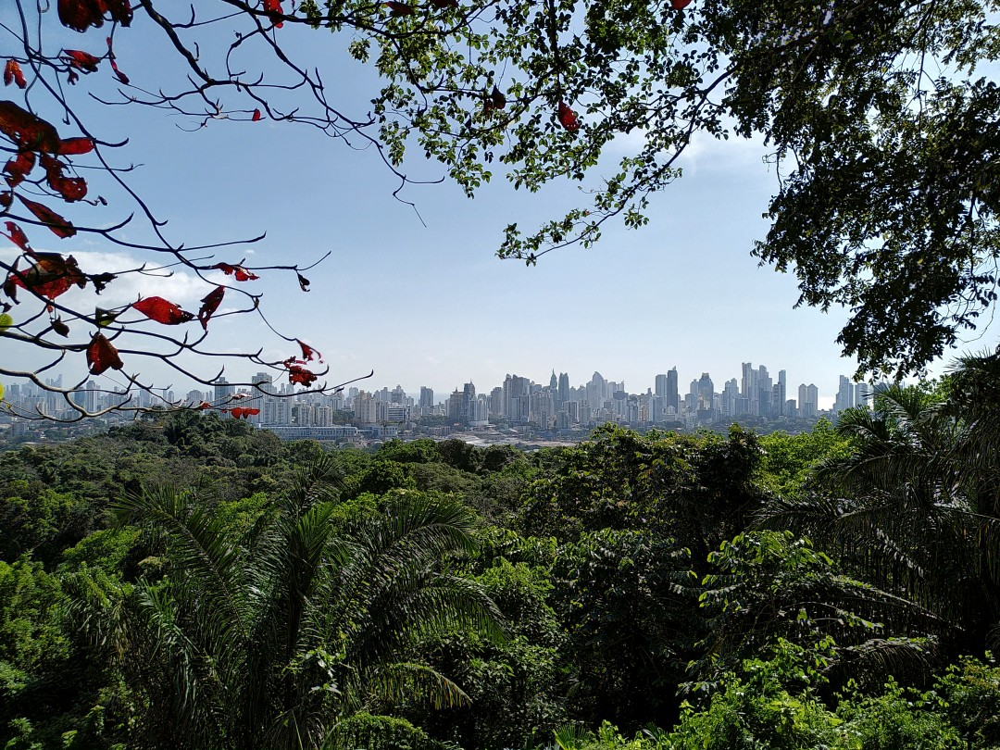
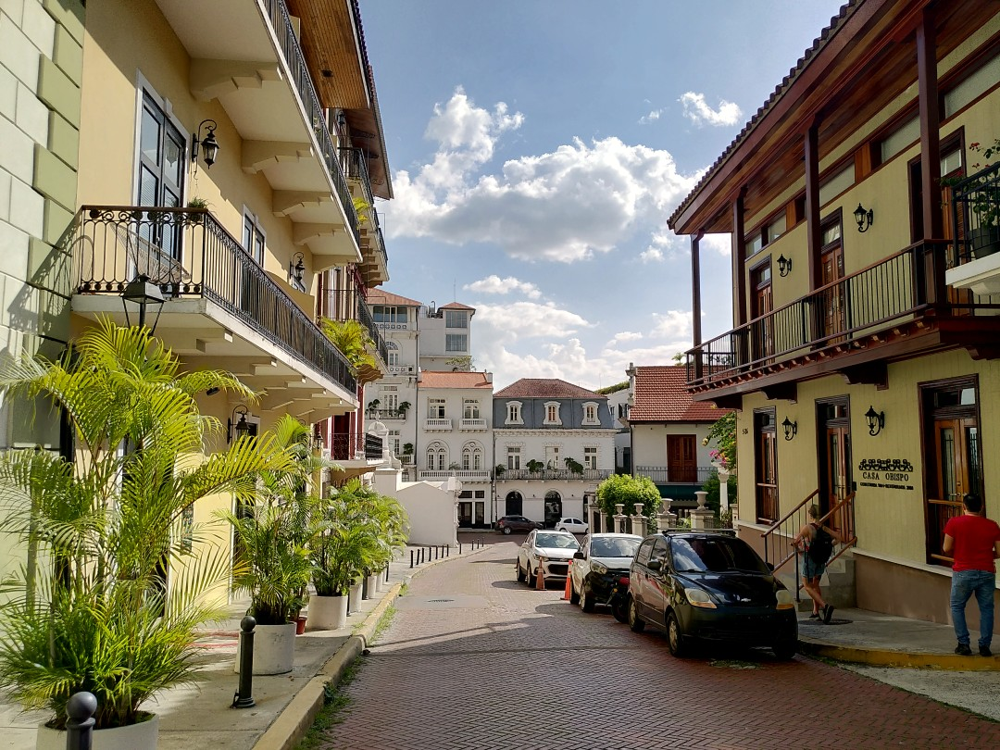
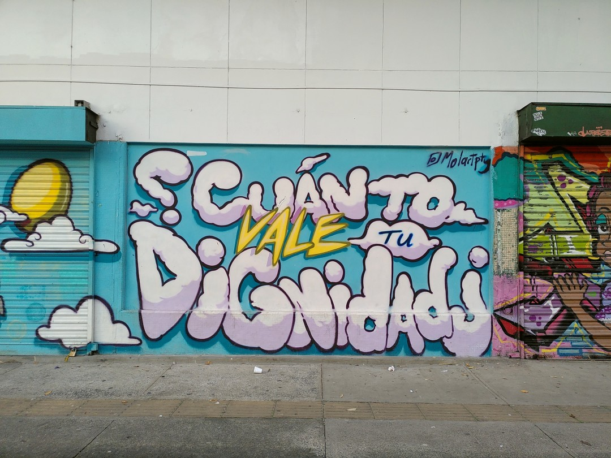

+++
title = "Ships & Skyscrapers"
date = 2025-03-07
authors = ["Julian"]

[extra]
location = [8.952475792982094, -79.53698480531196]
+++

Panama City is an interesting city I didn't really have a clue about before visiting.
With more than 1.2 million people in the metropolitan area, it has its fair share of busy streets and traffic of course.

Since the city is probably best known for its proximity to the Panama Canal, it also makes a lot of sense there are _a lot_ of really massive tankers and cargo ships in the ocean right off the city.
We were able to watch them from up close when taking the ferry to the beautiful island of Taboga to enjoy some nature and beaches.
Even though I'm very aware of the industry's impact on the environment, I find big ships fascinating and found [VesselFinder](https://www.vesselfinder.com/) as a great tool to get an idea about what they are up to.

What I definitely didn't expect was the number of high-rise buildings concentrated along the coast - even though this may well be a consequence of the city's strategic position as a major logistics hub.

The green _Parque Natural Metropolitano_ therefore does its name more than justice.
When we hiked through the forest on a warm morning, we both encountered a number of agoutis, turtles, a sloth slowly descending a tree and even lizards running over water as well as this great view of the skyline.

Then again, Panama City is not all residential area and skyscrapers either.
The _Casco Viejo_ neighbourhood is a very old part of the city that has been heavily renovated and gentrified in recent years.
Right by the seaside it has a high number of pricey hotels, bars and restaurants as well as some really good coffee shops (which are not cheap either, though).
As so often, it seemed to me that many original residents of the area did not profit from the investment in the area at all.
