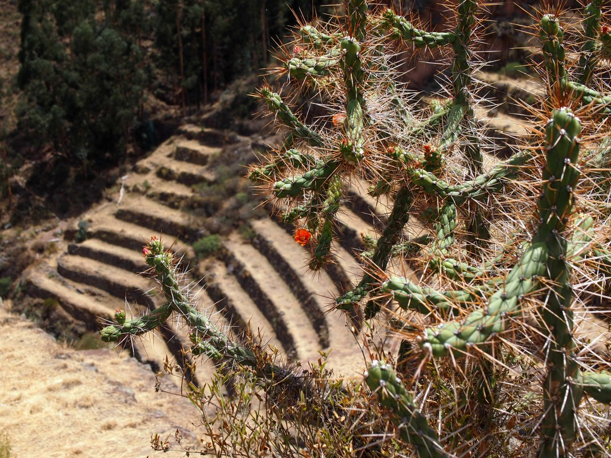
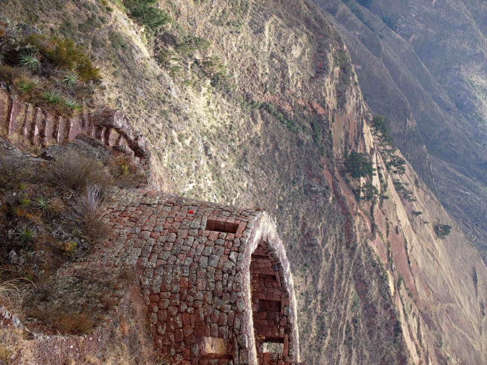
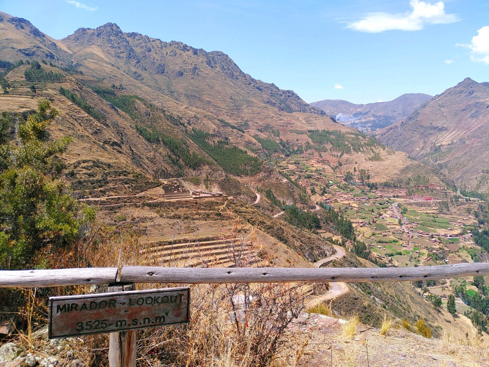
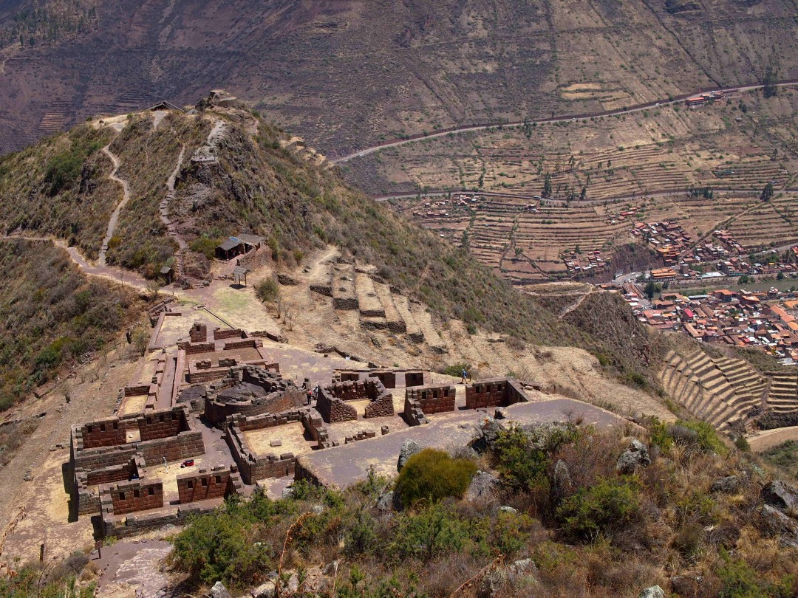
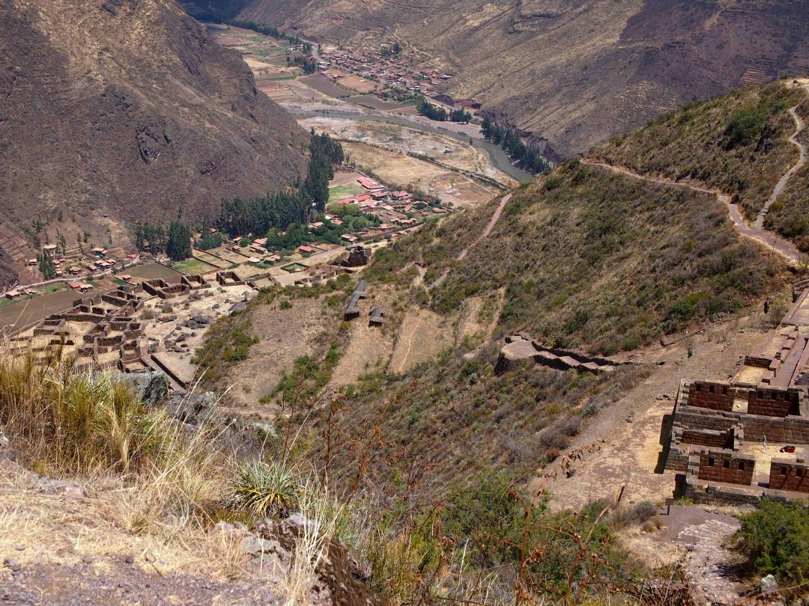
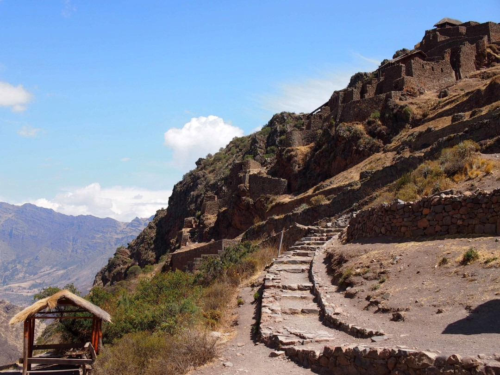

+++
title = "Citadel of Pisac"
date = 2024-10-30
authors = ["Julian"]

[extra]
location = [-13.406171515790723, -71.84466381999552]
+++

About an hour by public transport from Cusco, it is possible to visit an old Inka citadel near the town of Pisac.
After an ascent through typical agricultural terraces and flowering cacti, visitors get an incredible view of the architectural remains in front of an Andean panorama.

Given the considerable altitude, hiking up a few hundred meters in the sun can be quite exhausting - especially with insufficient acclimatisation.

I think the sights of various buildings constructed of neatly fitting stone blocks and the deep valley between massive Andean mountains are clearly worth it, though.

Noteworthy was the surprisingly low number of tourists all over the complex when we explored it.
Accessible Inka ruins in the region can get a lot more crowded!
