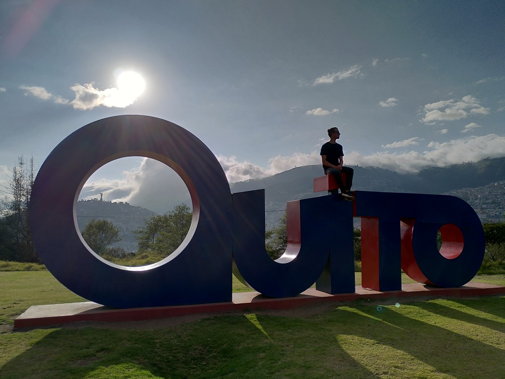
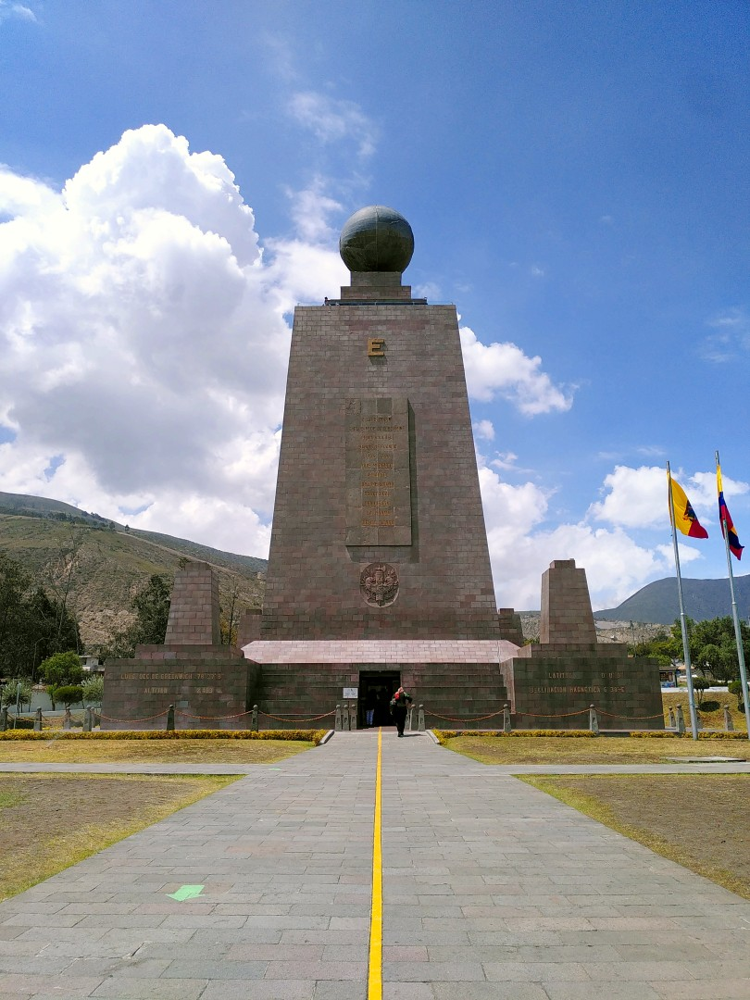

+++
title = "Close to the Sun"
date = 2025-01-08
authors = ["Julian"]

[extra]
location = [-0.22240494647238918, -78.49909813894652]
+++

We stayed in Quito for a few days in order to acclimatize ourselves to the altitude of the Andes again.

Stretched out between a number of volcanoes, the city offers plenty of colonial style architecture and narrow streets in a mountainous setting.

It's also home to a very beautiful botanical garden with numerous orchids, carnivorous plants and this cactus party between shady trees.

Another attraction in Quito is the _TeleferiQo_, a cable car taking passengers from 3117 to 3945 meters above sea level in just a few minutes.
After gaining an additional 750 meters of elevation by hiking, we met this curious _Carunculated Caracara_ at the peak of _Rucu Pichincha_, a former volcano.

The view improved significantly on our way back.
When we left the cloudy summit, we were able to enjoy an impressive panorama of the city nad its surrounding nature!

Last but not least, we had to visit the monument at _La Mitad del Mundo_ marking the equator where it was estimated before GPS was a thing.
