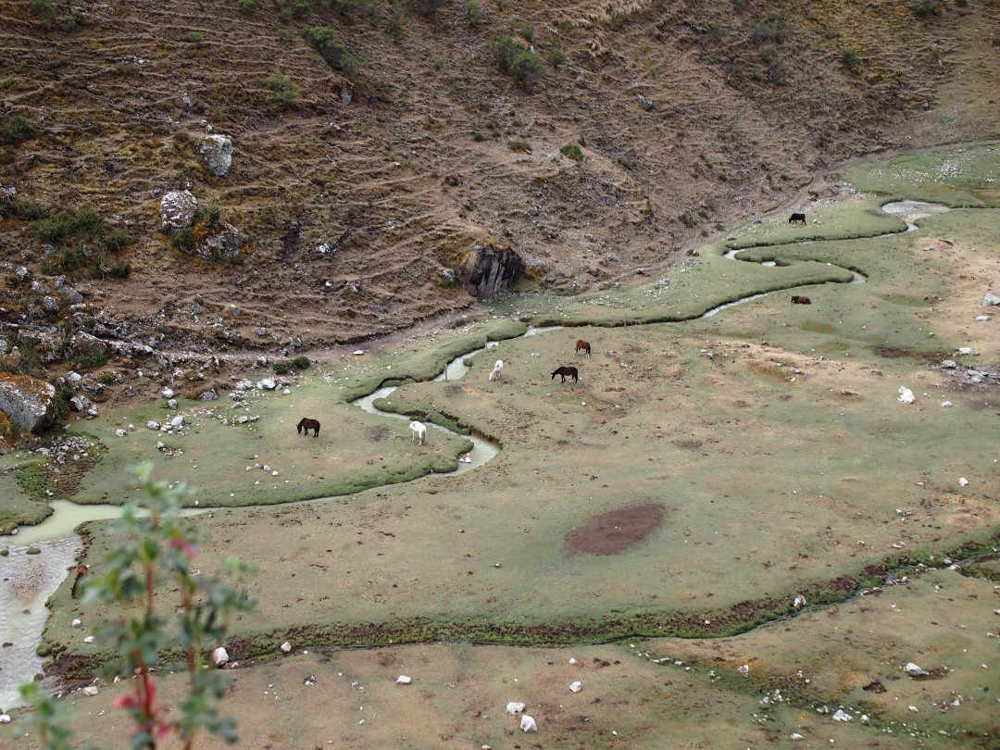

+++
title = "Over the Salkantay Pass"
date = 2024-11-03
author = "Julian"

[extra]
location = [-13.34644612201052, -72.56624835375679]
+++

On our hike to Machu Picchu we came across _Laguna Humantay_.
At about 4200 meters over sea level, it feeds from a glacier on the mountain of the same name.
Due to rainy weather and climate change however, there was not much to see of it.

We got to spend a night in a beautiful valley at 4000 meters.
It was as cold as it sounds, but the night sky was incredible!
Unfortunately I didn't manage to take a good picture of it.
We weren't able to watch it from the glass igloos either, since the windows fog up really quickly with people inside.

A group of curious llamas posed very kindly for us, though.

I feel like most of my pictures cannot really do the incredible views of the Andes justice.
Maybe the scale of these mountains is just hard to capture.

Even though the _Salkantay_ (quechua for "wild mountain") looked incredible with its 6264 meters, witnessing equally massive effects of global warming first hand felt both sad and scary to me.
While there are just sad remains of the glacier visible on the upper picture here, it once used to cover most of the mountain and form the giant ridge at its base and to its side on the lower picture.
The amount of ice that must have disappeared since is barely comprehensible.
