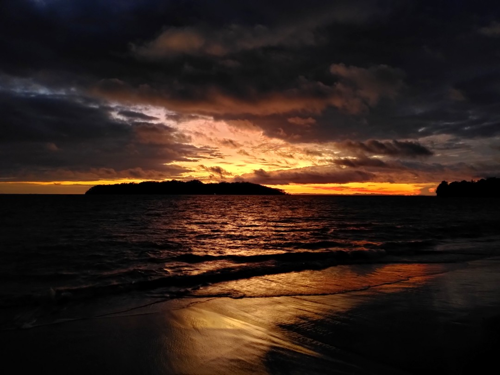
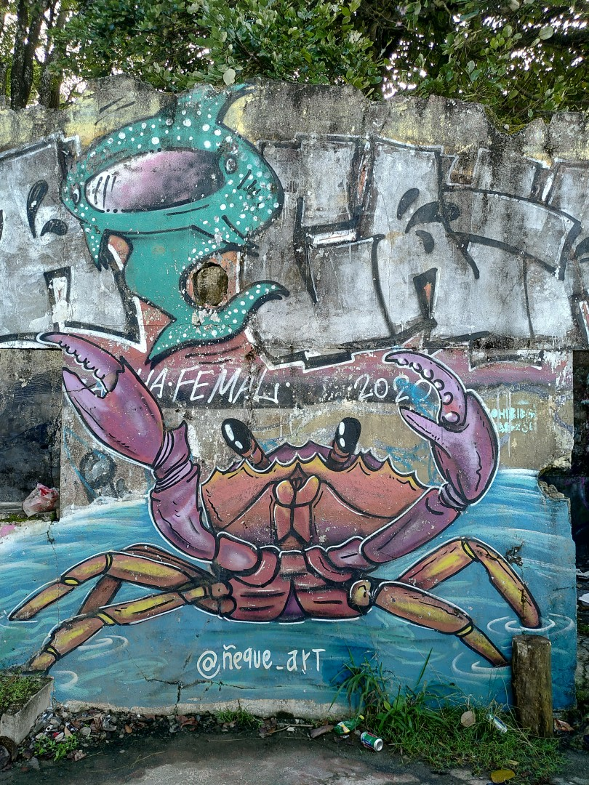
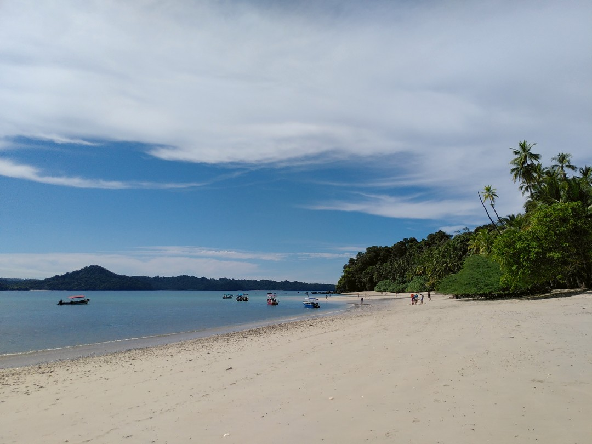
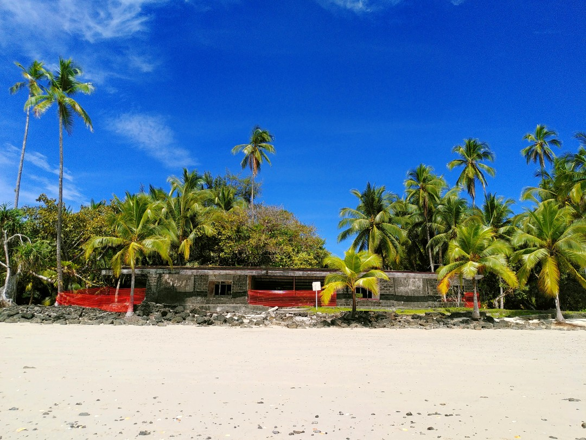

+++
title = "Sunsets, Sand & Snorkeling"
date = 2025-03-01
authors = ["Julian"]

[extra]
location = [7.63337477518077, -81.26043718375072]
+++

Since we unexpectedly had some more time to spend in Panama than expected, we decided to relax a few days on the Pacific coast in Santa Catalina.
There's not much to do in the former fishing village other than surfing, enjoying the rather wild beaches and environment or eating a good pizza.
However, it's located close to a number of islands and reefs around the former prison island of _Coiba_, which a lot of local operators offer boat and snorkeling tours to.

Besides swimming with an incredible amount of diverse marine wildlife such as various puffer and other fish, reef sharks and turtles, we also landed at some beaches for a break.
This one on _Coibita_ especially looked like a painting - with hermit crabs roaming the sand, clear blue water and coconut palms providing some shade.

The only building on the island seemed rather abandoned.
