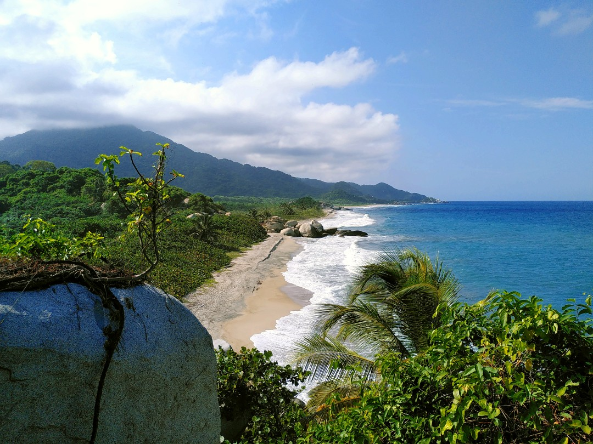
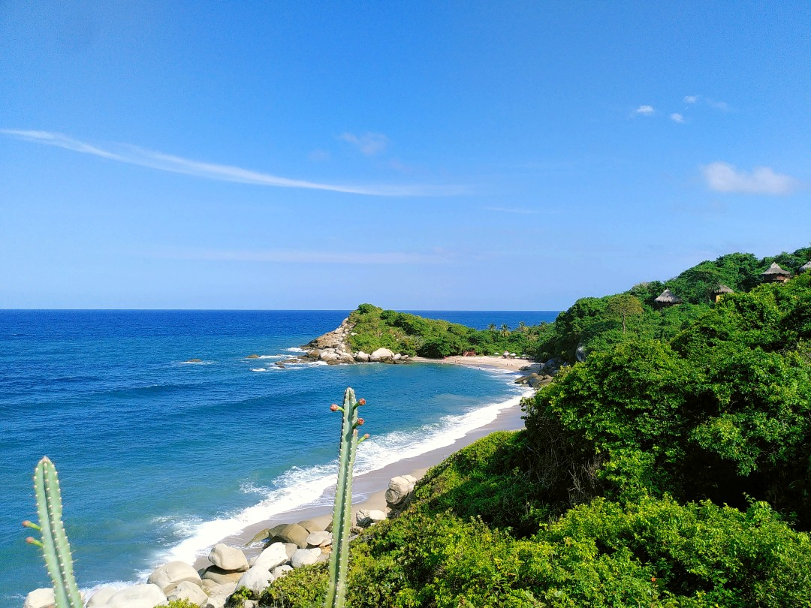
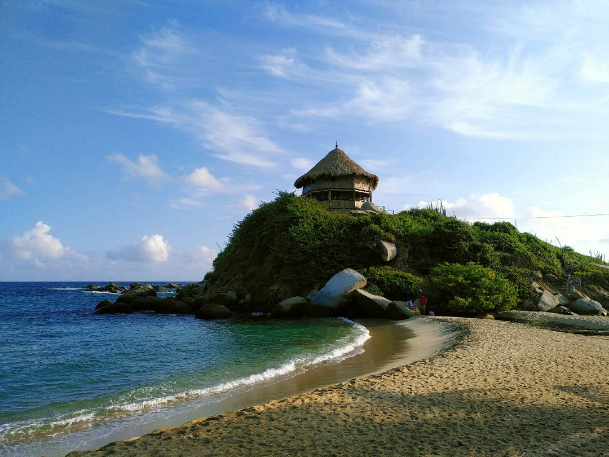
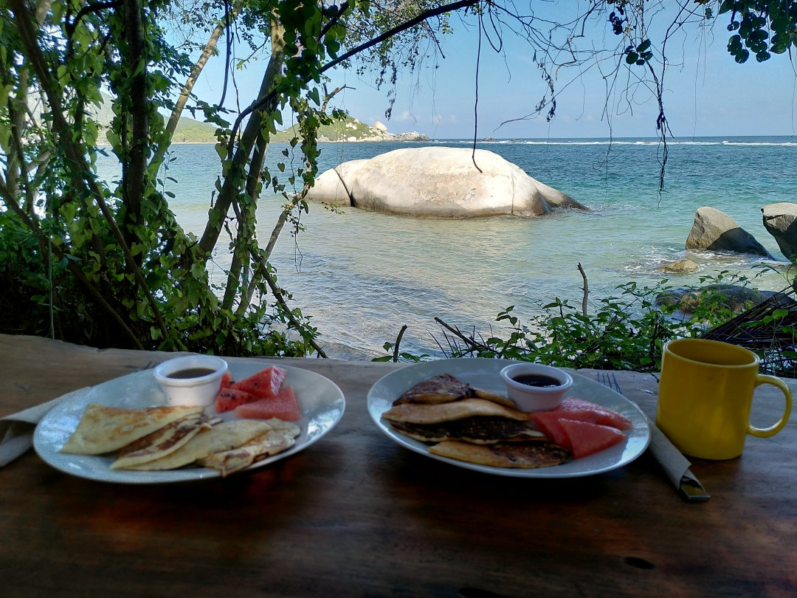

+++
title = "Beaches of the Caribbean"
date = 2025-02-26
authors = ["Julian"]

[extra]
location = [11.323829531504067, -73.9592993235672]
+++

The postcard-worthy landscape of Tayrona national park is located just about one hour by public transport from Santa Marta.
Sure, it's another hour walking a road through the jungle and then folloing the trail along the coast, but with a bit of luck there is a lot of wildlife waiting on the way.
Just on our first day in the park we encountered a family of howler monkeys, several groups of tamarin jumping through the trees, some agoutis, a sleeping sloth and lots of colourful lizards.

We slept in hammocks under mosquito nets on a local campground and went for a morning swim in peaceful warm water, before enjoying our breakfast with a priceless view.
On our way back to the bus stop, we met another cappucchin monkey eyeing our remaining snacks from only a couple meters distance.
