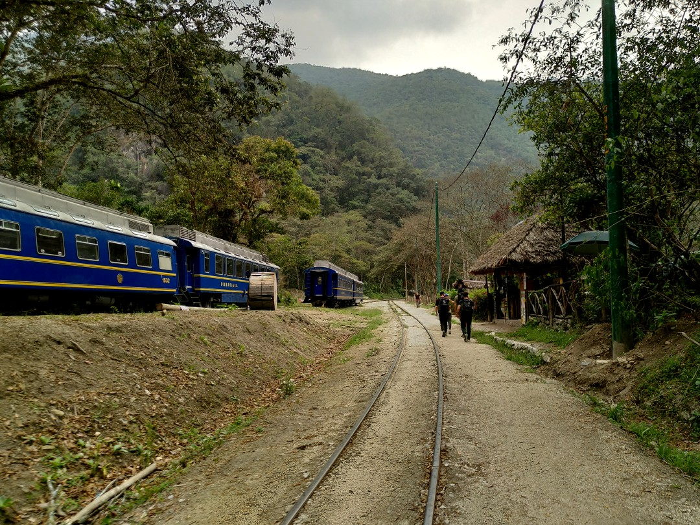

+++
title = "Along the Tracks"
date = 2024-11-08
authors = ["Julian"]

[extra]
location = [-13.159255568486454, -72.53822890701433]
+++

To finally get to Machu Picchu, we followed the train tracks to the same destination through the high jungle.

Luckily for our little hiking group, this cute café with delicious fruits, freshly backed goods and - most importantly - a roof appeared just as the rain started to pour.

Eventually we reached the small but very touristy town of Aguas Calientes in a stunning valley.
