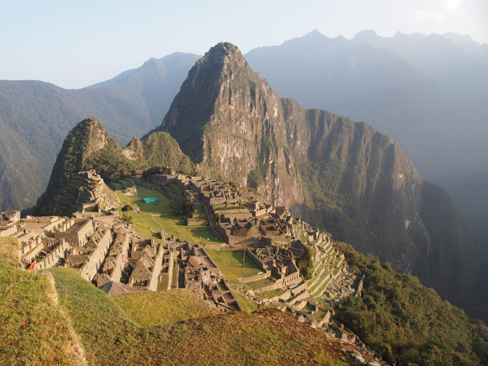

+++
title = "Travelling Latin America"
date = 2024-10-21
+++

Me and my partner are currently travelling Latin America and will continue to do so for the next months.
We've been in Peru for about three weeks now, witnessed snow-covered Andean summits, ancient Inka ruins, beautiful jungle wildlife and lots of busy streets.
And of course we took way to many photos of it all!

Since I finally have some time to sort them all, I'll try to follow up with some of the best pictures here soon.

This image of Machu Picchu in the morning sun came out of the camera like that.
Some places in Peru just look like post cards without any editing.
